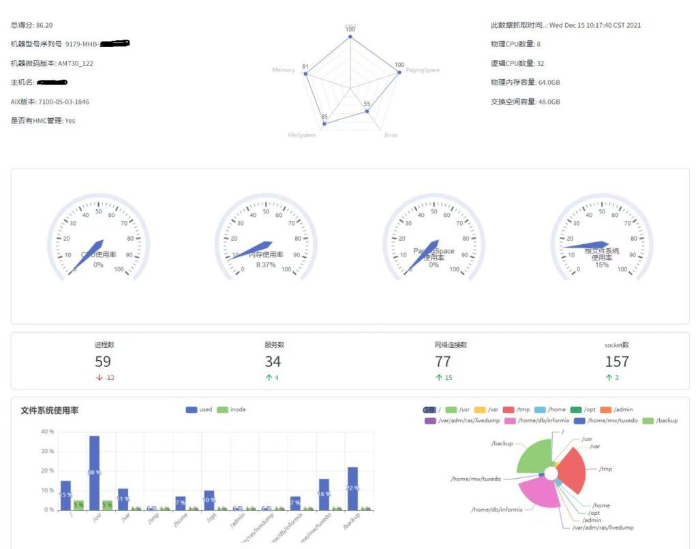
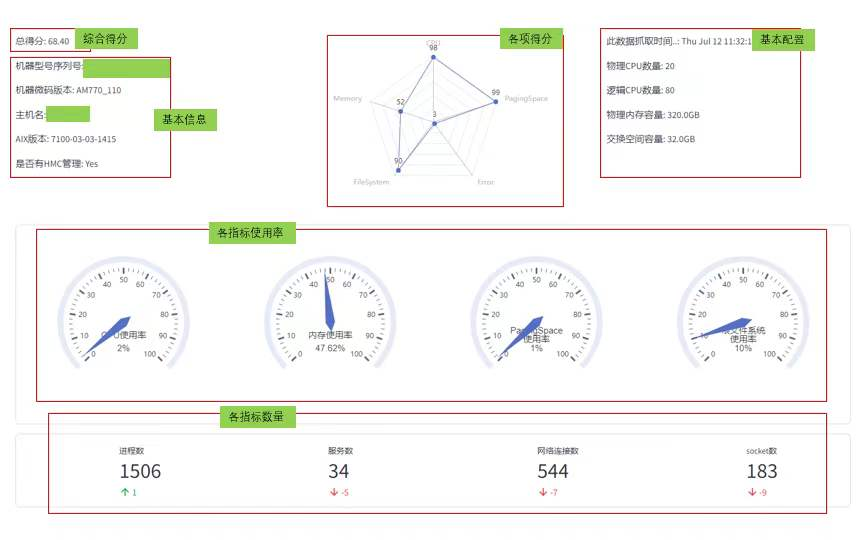
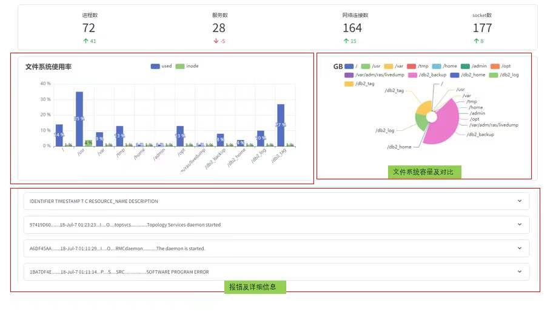

[AIX snap分析与可视化展示工具](http://hongxu.wang:4241 "AIX snap分析与可视化展示工具")
http://hongxu.wang:4241
海外版网址： http://jp.hongxu.wang
这是一款AIX的snap分析与可视化展示工具，希望能给您带来帮助。

2024-04-20 版本升级
v0.2.0.1:
1.支持除了-e以外的所有参数的AIX的snap数据。
2.自动识别snap参数，自动分析和展示结果。
3.添加了 解析FC、SCSI的错误解析功能

