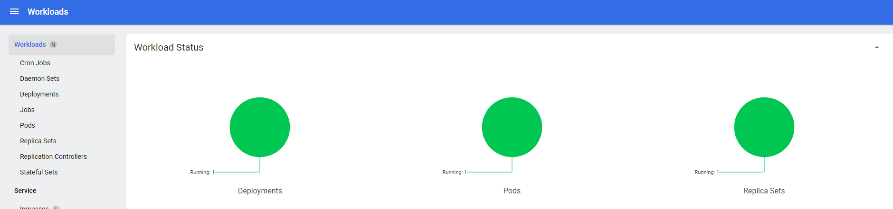

本文记录了在CentOS7.9上安装配置k8s集群的过程。

## 0.预留自用

## 1.版本及安装前提
### 1.1版本概述
宿主机: Windows 10  
虚拟机: VMware
虚拟机OS: CentOS7.9
MninKube: v1.30.1
Containerd: 1.6.20
Docker: 23.0.3
### 1.2安装前提
2 CPUs or more
2GB of free memory
20GB of free disk space
Internet connection
Container or virtual machine manager, such as: Docker, QEMU, Hyperkit, Hyper-V, KVM, Parallels, Podman, VirtualBox, or VMware Fusion/Workstation
link: https://minikube.sigs.k8s.io/docs/start
### 1.3过程概述
1. OS环境准备
2. 下载并安装CRI
3. 下载并安装minikube
4. 运行一个示例来测试minikube

## 2.OS环境准备
### 2.1 关闭防火墙
```shell
# hostnamectl set-hostname k8s-master
# systemctl stop firewalld
# systemctl disable firewalld
```
### 2.2 关闭selinux
```shell
# sed -i 's/enforcing/disabled/' /etc/selinux/config
```
### 2.3 关闭swap
删除swap那一行
```shell
# vim /etc/fstab
# reboot
```
### 2.4 设置主机名
注1：主机名不可以有下划线，但是可以有中间减号
```shell
# cat >> /etc/hosts << EOF
192.168.50.161 k8s-master
192.168.50.162 k8s-node1
192.168.50.163 k8s-node2
EOF
```
### 2.5 将桥接的IPv4流量传递到iptables的链
注：参考: https://kubernetes.io/zh-cn/docs/setup/production-environment/container-runtimes/
```shell
# cat <<EOF | sudo tee /etc/modules-load.d/k8s.conf
overlay
br_netfilter
EOF
# cat <<EOF | sudo tee /etc/sysctl.d/k8s.conf
net.bridge.bridge-nf-call-iptables  = 1
net.bridge.bridge-nf-call-ip6tables = 1
net.ipv4.ip_forward                 = 1
EOF
# sudo sysctl --system
# modprobe overlay
# modprobe br_netfilter
# sysctl net.bridge.bridge-nf-call-iptables net.bridge.bridge-nf-call-ip6tables net.ipv4.ip_forward
# lsmod | grep overlay
# lsmod | grep br_netfilter
```
### 2.6 时间同步
```shell
# yum install ntpdate -y
# ntpdate time.windows.com
```
## 3.下载并安装CRI
### 3.1 安装docker
```shell
# wget https://mirrors.aliyun.com/docker-ce/linux/centos/docker-ce.repo -O /etc/yum.repos.d/docker-ce.repo
# yum -y install docker-ce
# systemctl enable docker && systemctl start docker
# docker version
# ctr version
```
### 3.2 配置镜像下载加速器及 cgroup驱动 
这里的地址使用的是个人的阿里云的镜像加速器
k8s和docker默认cgroup驱动类型不一致，所以要修改
```shell
# cat > /etc/docker/daemon.json << EOF
{
	"registry-mirrors": ["https://8w7nxcxu.mirror.aliyuncs.com"],
	"exec-opts": ["native.cgroupdriver=systemd"]
}
EOF
# systemctl restart docker
```
### 3.3 安装cri-docker
注：参考: https://github.com/Mirantis/cri-dockerd 
从release版本中直接下载rpm包安装比较简单
Docker Engine 没有实现 CRI， 而这是容器运行时在 Kubernetes 中工作所需要的。 为此，必须安装一个额外的服务 cri-dockerd。 cri-dockerd 是一个基于传统的内置 Docker 引擎支持的项目， 它在 1.24 版本从 kubelet 中移除。
这里的地址使用的是个人的阿里云的镜像加速器
k8s和docker默认cgroup驱动类型不一致，所以要修改
```shell
# wget https://github.com/Mirantis/cri-dockerd/releases/download/v0.3.1/cri-dockerd-0.3.1-3.el7.x86_64.rpm
# rpm -ivh cri-dockerd-0.3.1-3.el7.x86_64.rpm
```
### 3.4 修改sandbox镜像
注意: 重载沙箱（pause）镜像
需要修改cri-docker.service, 指定network-plugin和pod-infra-container-image(否则后续kubeadm init会无法启动容器报错)
```shell
# vim /usr/lib/systemd/system/cri-docker.service
```
将[Service]下的
ExecStart=/usr/bin/cri-dockerd --container-runtime-endpoint fd://
替换成
ExecStart=/usr/bin/cri-dockerd --network-plugin=cni --pod-infra-container-image=registry.aliyuncs.com/google_containers/pause:3.8 --container-runtime-endpoint fd://
```shell
# systemctl start cri-docker && systemctl enable cri-docker
```
## 4.下载并安装k8s
### 4.1 添加YUM软件源
先添加阿里云YUM软件源，不然没有yum源安装下面的软件包
```shell
# cat > /etc/yum.repos.d/kubernetes.repo << EOF
[kubernetes]
name=Kubernetes
baseurl=https://mirrors.aliyun.com/kubernetes/yum/repos/kubernetes-el7-x86_64
enabled=1
gpgcheck=0
repo_gpgcheck=0
gpgkey=https://mirrors.aliyun.com/kubernetes/yum/doc/yum-key.gpg https://mirrors.aliyun.com/kubernetes/yum/doc/rpm-package-key.gpg
EOF
```
### 4.2 安装kubeadm，kubelet和kubectl
```shell
# yum install -y kubelet kubeadm kubectl
# systemctl enable kubelet
# systemctl start kubelet
```
### 4.3 初始化k8s(只在master节点运行)
```shell
# kubeadm init \
> --apiserver-advertise-address=192.168.50.161 \
> --image-repository registry.aliyuncs.com/google_containers \
> --kubernetes-version v1.26.0 \
> --service-cidr=10.96.0.0/12 \
> --pod-network-cidr=10.244.0.0/16 \
> --cri-socket unix:///var/run/cri-dockerd.sock
```
```shell
# mkdir -p $HOME/.kube
# sudo cp -i /etc/kubernetes/admin.conf $HOME/.kube/config
# sudo chown $(id -u):$(id -g) $HOME/.kube/config
```
这时候kubectl get node的命令的STATUS还是NotReady状态
### 4.4  部署容器网络（CNI）
下载calico.yaml文件，并将其中的定义Pod网络（CALICO_IPV4POOL_CIDR），与前面kubeadm init指定的一样，
注：注意：要去掉句首的井号，同时保持对齐，也就是要删除包括井号在内的2个字符，不然是对不齐的，对不齐就无法下一步。
             - name: CALICO_IPV4POOL_CIDR
                value: "10.244.0.0/16"
```shell
# wget --no-check-certificate https://projectcalico.docs.tigera.io/archive/v3.25/manifests/calico.yaml
# vi calico.yaml
# kubectl apply -f calico.yaml
```
### 4.5 将其他节点添加到cluster
从主节点拷贝文件到node节点
```shell
[root@k8s-master ~]# scp /etc/kubernetes/admin.conf root@k8s-node1:/etc/kubernetes/admin.conf
```
在node节点配置环境，并通过命令（在主节点的kube init的输出中有）将node节点加入到cluster
```shell
[root@k8s-client1 ~]# mkdir -p $HOME/.kube
[root@k8s-client1 ~]# cp -i /etc/kubernetes/admin.conf $HOME/.kube/config
[root@k8s-client1 ~]# chown $(id -u):$(id -g) $HOME/.kube/config
[root@k8s-client1 ~]# kubeadm join 192.168.50.161:6443 --token jegbfd.8o3br7xii8rouwov \
         --discovery-token-ca-cert-hash sha256:751b001f849848b388bf6e80bebaa4f8fb1f23c9b278957c0be7954422326556 \
         --cri-socket unix:///var/run/cri-dockerd.sock
```
## 5.部署Dashboard
### 5.1安装Dashboard
注：参考https://github.com/kubernetes/dashboard  里面的Install有yaml文件的位置，下载不了可以手动下载，然后将内容copy到机器里面
```shell
# wget https://raw.githubusercontent.com/kubernetes/dashboard/v2.7.0/aio/deploy/recommended.yaml
```

修改下载的配置文件：
kind: Service
apiVersion: v1
metadata:
  labels:
    k8s-app: kubernetes-dashboard
  name: kubernetes-dashboard
  namespace: kubernetes-dashboard
spec:
  type: NodePort	//添加这一条
  ports:
    - port: 443
      targetPort: 8443
      nodePort: 30001	//添加这一条

```shell
# vi recommended.yaml
```
然后运行
```shell
# kubectl apply -f ./dashboard.yaml 
```
### 5.2配置Dashboard
注：参考 https://github.com/kubernetes/dashboard/blob/master/docs/user/access-control/creating-sample-user.md

创建ServiceAccount和Binding的yaml文件
```shell
[root@k8s-master ~]# vi admin-user.yaml

apiVersion: v1
kind: ServiceAccount
metadata:
  name: admin-user
  namespace: kubernetes-dashboard
[root@k8s-master ~]# vi dashboard-user.yaml 

apiVersion: rbac.authorization.k8s.io/v1
kind: ClusterRoleBinding
metadata:
  name: admin-user
roleRef:
  apiGroup: rbac.authorization.k8s.io
  kind: ClusterRole
  name: cluster-admin
subjects:
- kind: ServiceAccount
  name: admin-user
  namespace: kubernetes-dashboard
```
应用ServiceAccount和Binding的文件，然后创建token
```shell
[root@k8s-master ~]# kubectl apply -f ./admin-user.yaml 
serviceaccount/admin-user created
[root@k8s-master ~]# kubectl apply -f ./dashboard-user.yaml 
clusterrolebinding.rbac.authorization.k8s.io/admin-user created
[root@k8s-master ~]# kubectl -n kubernetes-dashboard create token admin-user
```

### 5.3 登录Dashboard
用上一条命令输出的token，登录Dashboard
地址是任意节点的IP加上Port(30001)



## 6.创建一个pod测试
创建完成后，可以从pod运行的节点上直接ping通
```shell
# kubectl create deployment nginx --image=nginx
# kubectl get pods 
# kubectl get pods -o wide
# kubectl get pod,svc
```
通过上机的Svc的port，和任意node的IP（master不算，因为现在还没有设置master节点可以运行pode），就可以访问这个应用了
访问地址：http://NodeIP:Port
任意节点的IP加上上一条命令输出的PORT（这里是30754），都可以打开，就说明没问题了。

## 100. 从官方拉取镜像失败，可以用下面操作
grep image calico.yaml	//查看都需要拉取哪些镜像，然后
docker pull docker.io/calico/cni:v3.22.1	//手动在别的机器上拉取
docker save calico/cni:v3.22.1 > cni.tar	//保存镜像到tar文件
scp /root/cni.tar root@k8s-node1:/root/cni.tar

docker load < cni.tar	//从别的机器上拷贝过来，然后导入tar文件
kubectl delete -f calico.yaml
kubectl apply -f calico.yaml

## 101 参考
Centos7下k8s安装记录 (v1.26.0)
https://blog.csdn.net/zhangjunli/article/details/129043434