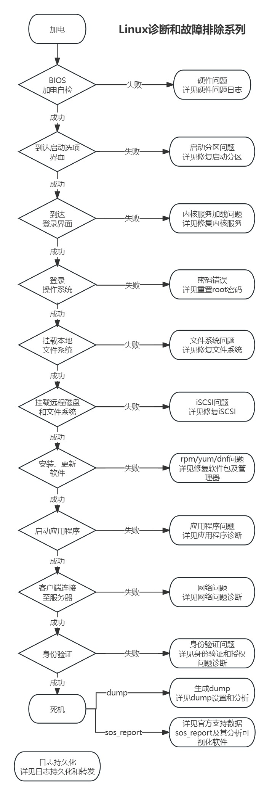

Linux诊断和故障排除系列
今天起将新开一个系列——Linux诊断和故障排除系列。
在这个系列中，我们将尽可能全面地覆盖Linux系统中可能遇到的各种故障场景，并提供详尽的解决步骤和策略。
我们诚挚地希望这个系列能够得到您的喜欢，并期待您提出宝贵的意见和建议。您的每一条反馈都是我们不断进步和完善的宝贵资源。
让我们一起探索Linux的奥秘，解决实际问题，提升我们的技术水平。感谢您的关注和支持！

# 第一步：加电自检
若自检失败，可能是硬件故障。详情请参考[<<Linux诊断和故障排除系列(十) -- 硬件问题日志>>](http://hongxu.wang/linux_pd_10_hardware_log "<<Linux诊断和故障排除系列(十) -- 硬件问题日志>>")
# 第二步：到达启动选项界面
若无法到达此界面，可能是启动分区出现问题。解决方案详见[<<Linux诊断和故障排除系列(一) -- 修复启动分区>>](http://hongxu.wang/linux_pd_01_boot "<<Linux诊断和故障排除系列(一) -- 修复启动分区>>")
# 第三步：到达登录界面
若无法到达登录界面，可能是内核服务加载异常。修复方法请见[<<Linux诊断和故障排除系列(二) -- 修复内核服务>>](http://hongxu.wang/linux_pd_02_kennel_service "<<Linux诊断和故障排除系列(二) -- 修复内核服务>>")
# 第四步：登录操作系统
若登录失败，可能是由于密码错误。密码重置指南请参考[<<Linux诊断和故障排除系列(三) -- 重置root密码>>](http://hongxu.wang/linux_pd_03_reset_root_password "<<Linux诊断和故障排除系列(三) -- 重置root密码>>")
# 第五步：挂载本地文件系统
若挂载失败，可能是文件系统损坏。修复指导请见[<<Linux诊断和故障排除系列(四) -- 修复文件系统>>](http://hongxu.wang/linux_pd_04_fix_fs "<<Linux诊断和故障排除系列(四) -- 修复文件系统>>")
# 第六步：挂载远程磁盘和文件系统
若挂载远程磁盘和文件系统失败，可能是iSCSI配置问题。修复步骤请参考[<<Linux诊断和故障排除系列(五) -- 修复iSCSI>>](http://hongxu.wang/linux_pd_05_fix_iscsi "<<Linux诊断和故障排除系列(五) -- 修复iSCSI>>")
# 第七步：安装、更新软件
若软件相关问题，可能是yum/dnf等软件包管理器出现问题。解决方案详见[<<Linux诊断和故障排除系列(六) -- 修复软件包及管理器>>](http://hongxu.wang/linux_pd_06_fix_rpm_yum "<<Linux诊断和故障排除系列(六) -- 修复软件包及管理器>>")
# 第八步：启动应用程序
若应用程序启动失败，可能是应用程序本身存在问题。诊断方法请见[<<Linux诊断和故障排除系列(七) -- 应用程序诊断>>](http://hongxu.wang/linux_pd_07_fix_app "<<Linux诊断和故障排除系列(七) -- 应用程序诊断>>")
# 第九步：客户端连接至服务器
若连接失败，可能是网络配置问题。网络问题诊断指南请参考[<<Linux诊断和故障排除系列(八) -- 网络问题诊断>>](http://hongxu.wang/linux_pd_08_fix_network "<<Linux诊断和故障排除系列(八) -- 网络问题诊断>>")
# 第十步：身份验证
若身份验证失败，可能是认证和授权设置问题。解决方案请见[<<Linux诊断和故障排除系列(九) -- 身份验证和授权问题诊断>>](http://hongxu.wang/linux_pd_09_fix_authentication "<<Linux诊断和故障排除系列(九) -- 身份验证和授权问题诊断>>")
# 第十一步：死机，生成dump
当系统死机时，核心转储文件（dump）的生成与分析是关键。详细步骤请参考[<<Linux诊断和故障排除系列(十一) -- dump设置和分析>>](http://hongxu.wang/linux_pd_11_dump "<<Linux诊断和故障排除系列(十一) -- dump设置和分析>>")
# 第十二步：收集官方支持数据
sos_report是Red Hat及其衍生版(Centos/Ubuntu等)中默认自带的工具，用来收集系统的信息，以便在遇到问题时Red Hat原厂准确地诊断问题并提供官方技术支持。
关于sos_report数据的收集步骤，以及我的免费sos_report数据分析和可视化软件，请见[<<Linux诊断和故障排除系列(十三) -- 官方支持数据sos_report及其分析可视化软件>>](ttp://hongxu.wang/linux_pd_13_sos_report "<<Linux诊断和故障排除系列(十三) -- 官方支持数据sos_report及其分析可视化软件>>")
# 第十三步：Linux的日志持久化
了解如何持久化和管理Linux日志，以便于故障追踪和系统监控。详情请参考[<<Linux诊断和故障排除系列(十二) -- 日志持久化和转发>>](http://hongxu.wang/linux_pd_12_jounald "<<Linux诊断和故障排除系列(十二) -- 日志持久化和转发>>")

本文内容为原创，如需转载，请务必注明原文出处。
更多相关内容，欢迎访问我的个人网站：hongxu.wang。
我们还提供免费的技术支持，欢迎与我们联系。