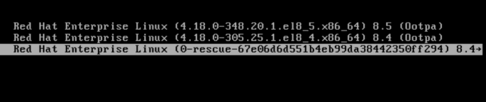
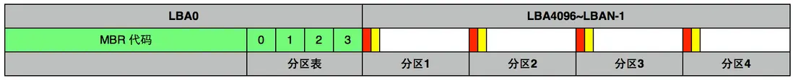
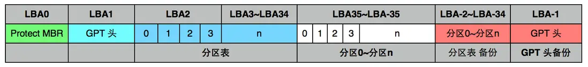
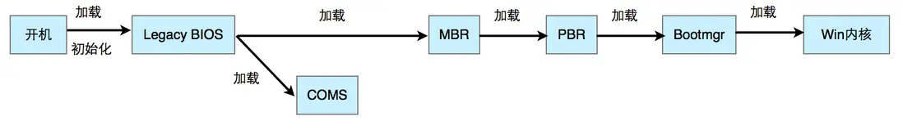
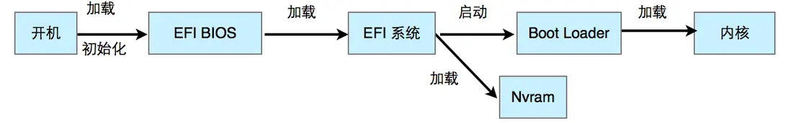
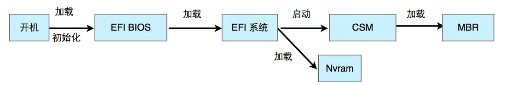
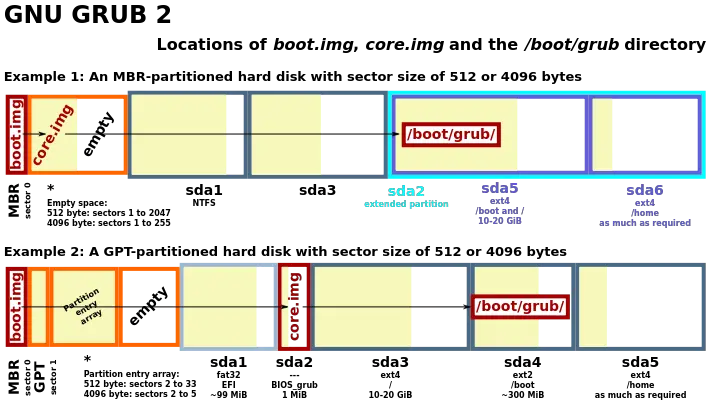

这里PD的部分是到Bootloader及以上的部分，也就是还没有到加载kernel和Runlevel。
# 01.查看是BIOS还是UEFI
第一步是查看是BIOS还是UEFI：
在 BIOS/Legacy 启动模式下，GRUB 通常安装在硬盘的 MBR (Master Boot Record) 区域。所以GRUB在 /boot/grub2/grub.cfg
在 UEFI 启动模式下，GRUB 的 EFI 应用程序和配置文件存储在 EFI 系统分区 (ESP) 中。所以GRUB在/boot/efi/EFI/grub/grub.cfg 或 /efi/EFI/grub/grub.cfg。
```shell
$ find /boot -name grub*cfg
/boot/grub2/grub.cfg
```
```shell
$ fdisk -l

Disk /dev/vda: 42.9 GB, 42949672960 bytes, 83886080 sectors
Units = sectors of 1 * 512 = 512 bytes
Sector size (logical/physical): 512 bytes / 512 bytes
I/O size (minimum/optimal): 512 bytes / 512 bytes
Disk label type: dos                                                    <<<<<<对于GPT分区表，GPT；对于MBR分区表，DOS或MBR。
Disk identifier: 0x000f24de

   Device Boot      Start         End      Blocks   Id  System
/dev/vda1   *        2048    83886079    41942016   83  Linux
$ parted -l
Model: Virtio Block Device (virtblk)
Disk /dev/vda: 42.9GB
Sector size (logical/physical): 512B/512B
Partition Table: msdos                                                  <<<<<<对于GPT分区表，GPT；对于MBR分区表，DOS或MBR。
Disk Flags: 

Number  Start   End     Size    Type     File system  Flags
 1      1049kB  42.9GB  42.9GB  primary  ext4         boot
```
可以通过查找grub.cfg文件来确定
```shell
$ ls -al /boot/
......
drwxr-xr-x.  3 root root     4096 Jul 12  2023 efi
drwxr-xr-x.  2 root root     4096 Jul 12  2023 grub
drwx------.  5 root root     4096 Jul 12  2023 grub2
$ ls -al /boot/efi/EFI/
...drwx------. 2 root root 4096 Dec 17  2022 centos
$ ls -al /boot/efi/EFI/centos/      <<<这里没有grub.cfg ，所以不是UEFI
total 8
drwx------. 2 root root 4096 Dec 17  2022 .
drwxr-xr-x. 3 root root 4096 Jul 12  2023 ..
$ ls -al /boot/grub2/               <<<这里有grub.cfg ，所以是BIOS
total 44
drwx------. 5 root root  4096 Jul 12  2023 .
dr-xr-xr-x. 5 root root  4096 Apr  5 09:28 ..
-rw-r--r--. 1 root root    64 Jul 12  2023 device.map
drwxr-xr-x. 2 root root  4096 Jul 12  2023 fonts
-rw-r--r--  1 root root  5347 Jul 12  2023 grub.cfg
-rw-r--r--. 1 root root  1024 Jul 12  2023 grubenv
drwxr-xr-x. 2 root root 12288 Jul 12  2023 i386-pc
drwxr-xr-x. 2 root root  4096 Jul 12  2023 locale
```

# 02. RHEL救援模式(使用启动光盘)
RHEL Rescue Mode，无法到达GRUB界面，也就是在GRUB前介入，可以修改和更新GRUB
<font color=red>如果GRUB相关错误，例如grub.cfg文件丢失，会导致无法启动，需要用recovery disk(也就是安装盘)来启动机器：</font>
## 2.1. 选择"Troubleshooting"，
还有其他选项： "Install Red Hat Enterprise Linux 8.4"和"Test this media & insall Red Hat Enterprise Linux 8.4"
## 2.2. 选择"Rescue a Red Hat Enterprise Linux"，
进入救援模式，它会尝试搜索系统盘并挂载
## 2.3. 选1) Continue
会看到如下：
   1) Continue
   2) Read-only mount
   3) Skip to shell
   4) Quit(Reboot)
## 2.4. 根目录挂载到/mnt/sysroot下
尝试1，会把根目录挂载到/mnt/sysroot下。然后可以使用chroot /mnt/sysroot来访问根目录。然后去查看是什么问题。
4.1 如果文件系统没有被挂载，可能有LVM问题。可以运行以下命令：lvscan来查看LV等信息，看看能不能手动mount。再用vgchange -ay启用你的文件系统，然后就可以用mount来挂载你的FS了: mount /path/to/fs /mnt/sysimage ，最后用chroot /mnt/sysimage来访问。然后去查看是什么问题。
## 2.5. 查看这个OS是使用BIOS还是UEFI
## 2.6. 重新安装GRUB2
(在 /boot/ 分区上恢复 GRUB。)
   6.1 如果是BIOS，则使用 grub2-install /dev/sda
   6.2 如果是UEFI，则使用 yum reinstall grub2-efi shim      <<<两个软件包grub2-efi 和 shim ，也可以使用dnf安装
   6.3 如果是IBM Power 机器，确定存储 GRUB 的磁盘分区：$ bootlist -m normal -o，然后在磁盘分区上重新安装 GRUB： grub2-install partition
   参考link: 主页>产品>Red Hat Enterprise Linux>8>管理、监控和更新内核>第 9 章 重新安装 GRUB
   https://docs.redhat.com/zh_hans/documentation/red_hat_enterprise_linux/8/html/managing_monitoring_and_updating_the_kernel/assembly_reinstalling-grub_managing-monitoring-and-updating-the-kernel

## 2.7. 重新配置GRUB2
### 2.7.1 删除配置文件
```shell
# rm /etc/grub.d/*
# rm /etc/sysconfig/grub
```
### 2.7.2 重新安装软件包。
7.2.1 在基于 BIOS 的机器上，输入：yum reinstall grub2-tools
7.2.2 在基于 UEFI 的机器上，输入：yum reinstall grub2-efi shim grub2-tools
### 2.7.3 重建 grub.cfg 文件以使更改生效。
grub2-mkconfig     //直接生成grub2的配置到标准输出
7.3.1 在基于 BIOS 的机器上，输入：grub2-mkconfig -o /boot/grub2/grub.cfg            //BIOS，生成grub2的配置到BIOS的grub2.cfg的文件中
7.3.2 在基于 UEFI 的机器上，输入：grub2-mkconfig -o /boot/efi/EFI/redhat/grub.cfg   //UEFI，生成grub2的配置到UEFI的grub2.cfg的文件中
参考link: 主页>产品>Red Hat Enterprise Linux>8>管理、监控和更新内核>9.4. 重置 GRUB    https://docs.redhat.com/zh_hans/documentation/red_hat_enterprise_linux/8/html/managing_monitoring_and_updating_the_kernel/proc_resetting-grub_assembly_reinstalling-grub
## 2.8. 重启
```shell
$ exit      //退出chroot
$ reboot        //重启
```
# 03. GRUB救援模式(不需要启动光盘)
GRUB Rescue Mode，可以访问GRUB，但无法加载kernel。这时需要进入GRUB Rescue Mode。
## 3.1. 在启动选项里选择"0-rescue"的标签的内核。

## 3.2. 进入精简版内核，重新配置GRUB2
### 3.2.1 删除配置文件
```shell
# rm /etc/grub.d/*
# rm /etc/sysconfig/grub
```
### 3.2.2 重新安装软件包。
7.2.1 在基于 BIOS 的机器上，输入：yum reinstall grub2-tools
7.2.2 在基于 UEFI 的机器上，输入：yum reinstall grub2-efi shim grub2-tools
### 3.2.3 重建 grub.cfg 文件以使更改生效。
grub2-mkconfig     //直接生成grub2的配置到标准输出
7.3.1 在基于 BIOS 的机器上，输入：grub2-mkconfig -o /boot/grub2/grub.cfg            //BIOS，生成grub2的配置到BIOS的grub2.cfg的文件中
7.3.2 在基于 UEFI 的机器上，输入：grub2-mkconfig -o /boot/efi/EFI/redhat/grub.cfg   //UEFI，生成grub2的配置到UEFI的grub2.cfg的文件中
参考link: 主页>产品>Red Hat Enterprise Linux>8>管理、监控和更新内核>9.4. 重置 GRUB    https://docs.redhat.com/zh_hans/documentation/red_hat_enterprise_linux/8/html/managing_monitoring_and_updating_the_kernel/proc_resetting-grub_assembly_reinstalling-grub
## 2.3. 重启
```shell
$ exit      //退出chroot
$ reboot        //重启
```


# 10. MBR和GPT关系
## 10.1 MBR和GPT
磁盘分区表格式目前主要有两种，分别是MBR分区表和GPT分区表。(是的，MBR有两个意思，一个表示主引导记录，一个表示分区表类型)

### 10.1.1 MBR：
MBR：主引导记录位置在磁盘的第一个逻辑扇区，即LBA0的位置。一个逻辑扇区仅有512B（字节） ，MBR引导代码占446B，MBR分区表占64B，最后的magic number占2B（即上述以0x55 0xAA结尾的标识符）。因为每个分区只有16B大小的分区表记录，所以寻址最大只能到2.2TB，并且由于分区表总共只占64B，所以MBR分区表最多4个分区。下图的绿色部分。
### 10.1.2 PBR
PBR：即Partition Boot Record，对应主引导记录，每个分区都存在引导记录，位置在每个磁盘分区的开始部分，占用扇区不定。这个扇区一般保存着操作系统引导程序的所在位置。下图的红色部分。
File System：操作系统对磁盘的所有操作都需要经过文件系统，删除文件指的是在文件系统里删除文件的索引条目，创建文件就是在在文件系统里添加索引条目并将具体数据写入磁盘。常见的文件系统格式有：FAT、ext4、NTFS。文件系统位置一般在PBR之后。下图黄色部分。


### 10.1.3 GPT
GPT(Globally Unique Identifier Partition Table)，简称GPT或GUID分区表，它是UEFI规范的一部分。
GPT由GPT头和GPT主体，GPT备份组成。起始于磁盘LBA1的位置，相对的LBA0仍然为MBR，但是这个MBR是被保护的，没有引导代码，仅仅有一个被标识为未知的分区，当支持GPT分区表的操作系统检索到这个MBR后就会自动忽略并跳到LBA1读取GPT分区表。

PMBR存在的意义是当不支持GPT的分区工具试图对硬盘进行操作时（例如MS-DOS和Linux的fdisk程序），它可以根据这份PMBR以传统方式启动，过程和MBR+BIOS完全一致，极大地提高了兼容性。而支持GPT的系统在检测PMBR后会直接跳到GPT表头读取分区表。和MBR类似，分区表中存储了某个分区的起始和结束位置及其文件系统属性信息，而分区才是实际存在的物理磁盘的一部分
## 10.2 BIOS
BIOS(Basic Input/Output System)包括POST。它负责在计算机启动时初始化硬件设备，并运行引导加载程序。BIOS只认识设备，不认识分区、不认识文件。
BIOS启动时，按照CMOS设置的顺序，挨个查看存储设备的前512字节是不是以0x55 0xAA结尾，如果不是就跳过找下一个设备；如果是的话，则表示这个磁盘可以启动，加载这512字节里的代码，执行之后，后面的事，就跟BIOS没关系了。至于加载引导代码后面启动什么系统，取决于这512B（字节）里存了什么系统的代码。

### 10.2.1 BIOS 引导流程
加电，ROM里的BIOS就会被加载到内存运行，BIOS自检完毕以后加载COMS的参数，通过COMS的参数，BIOS程序加载启动磁盘的MBR到内存里运行，运行MBR的引导代码，这段代码会查找活动分区（BIOS不认识活动分区，但这段代码认识活动分区）的位置，加载并执行活动分区的PBR（另一段引导程序），与MBR类似，PBR在运行后加载操作系统的引导程序到内存运行，例如Windows的bootmgr或Linux的grub。当引导程序运行后，操作系统内核就被加载运行，完成从BIOS程序中接手的引导流程，整体流程如下图：


## 10.3 UEFI
UEFI(Unified Extensible Firmware Interface)旨在代替BIOS。UEFI拥有前辈所不具备的诸多功能，比如图形化界面、多种多样的操作方式、允许植入硬件驱动等等。UEFI还包含了其他功能，它支持安全引导，这意味着可以检查操作系统的有效性，以确保没有恶意软件篡改引导过程。它可以在UEFI固件本身中支持联网特性，这有助于远程故障排除和配置。UEFI采用了向后兼容，所以BIOS切换为UEFI不可以，而UEFI切换为BIOS是可以的。
BIOS只能在16位模式下运行，而UEFI可以在32位或64位模式下运行，并且具有比BIOS更多的可寻址地址空间，这意味着引导过程更快。
UEFI采用GPT分区表的方式后，硬盘容量和分区数目几乎没有上限（目前windows支持最大128个分区）。

### 10.3.1 UEFI 引导流程
加电，ROM里的UEFI BIOS就会被加载到内存运行。UEFI BIOS将引导EFI系统进行运行。在EFI系统启动后，GUID分区表就会被识别，之后EFI系统就会通过.efi文件启动Boot Loader程序加载操作系统内核。

对于分区表格式为MBR分区表的磁盘，UEFI系统会 先启动CSM兼容模式后按传统BIOS的步骤加载操作系统的内核。如下图：

## 10.4 GRUB
GRUB（Grand Unified Boot loader）是硬盘中的软件，引导器（loader）的一种。目前主流版本是 GRUB2
GRUB是一个来自GNU项目的启动引导程序。GRUB是多启动规范的实现，它允许用户可以在计算机内同时拥有多个操作系统，并在计算机启动时选择希望运行的操作系统。GRUB可用于选择操作系统分区上的不同内核，也可用于向这些内核传递启动参数。
对于只支持BIOS的主板，可以使用grub进入grub命令行，然后为grub添加第三方的EFI shell模块，然后就可以启动那些使用EFI启动的OS了。对于只有EFI的主板，当然可以写个.efi文件，然后转去读取MBR传统引导。
### 10.4.1 GRUB位置
启动代码（boot.img）直接安装在MBR中，然后执行GRUB内核镜像（core.img），最后从/boot/grub中读取配置和其他功能代码。
GRUB的执行顺序为boot.img –> core.img –> /boot/grub/。
MBR分区表和GPT分区表的GRUB引导文件所放分区不同:

在MBR分区表中，boot.img和core.img都在MBR中。MBR虽然只占用一个扇区(512Byte)，但是其所在的磁道是空闲的，不会用于分区，可以放下core.img。
在GPT分区表中，MBR为protected MBR（为兼容MBR，在硬盘起始位置保留的空间），后面并没有空间放core.img，需要建一个专门的分区来放，称为BIOS boot partition，该分区的文件类型为unformatted，flag为BOIS_grub，该flag用于标识core.img所要安装到的分区。若果使用UEFI引导，GRUB读取的是ESP分区中的数据，不需要flag为BIOS_grub的分区。

https://segmentfault.com/a/1190000020850901
POST(Power-On Self-Test)是计算机启动时执行的自检程序，由 BIOS 提供。当计算机接通电源后，POST 会检查系统的关键组件（如 RAM、CPU、硬盘等）是否正常工作。
Boot Loader(引导加载程序):包括Boot Sector。是在操作系统内核加载之前运行的一段小程序，它负责加载操作系统内核到内存中，并将其启动。
Boot Sector (引导扇区):引导扇区是硬盘上的第一个扇区（通常是第一个磁道的第一个扇区）。在传统的 MBR 启动过程中，引导扇区包含了一个引导加载程序。