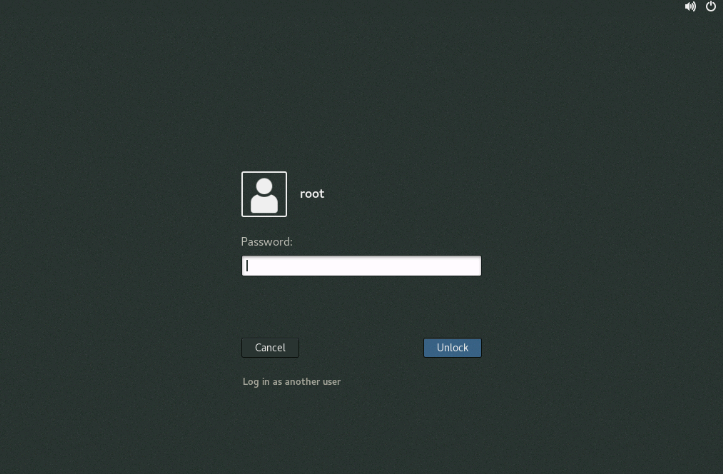
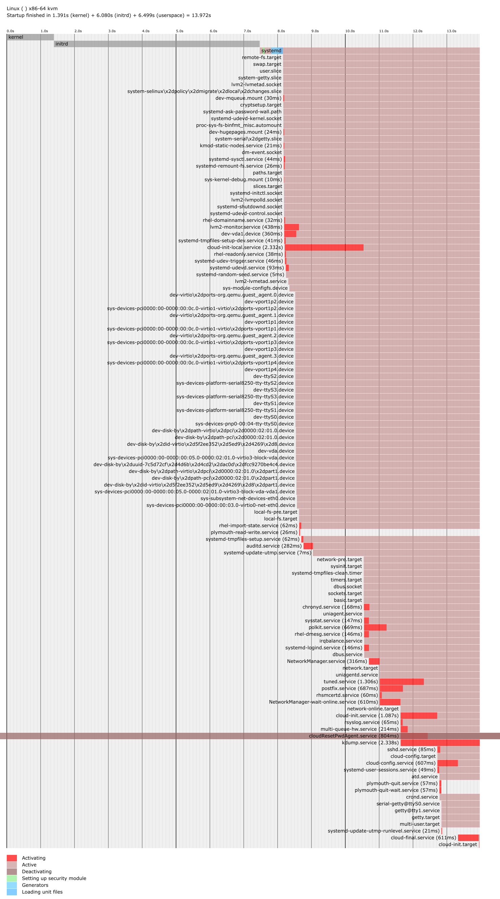
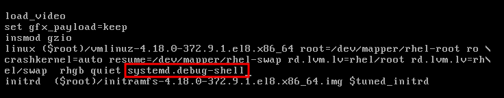
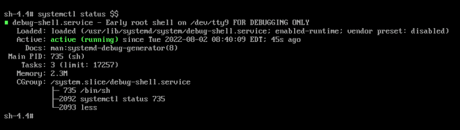
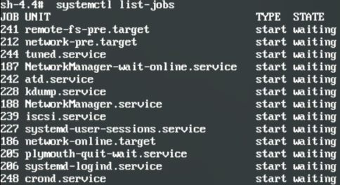

<font color=red>如果某个Unit(服务)无法正常启动，那么在启动操作系统的时候，可能hang在初始化GUI界面而显示不出来，这时就要进入debug-shell，去查看是哪个服务卡了，导致的无法启动。</font>
若无法到达登录界面(如下图)，可能是内核服务加载异常。
也就是在启动的时候，遇到了某个服务无法启动时，很可能是这个服务的 依赖链 的问题，而这个问题可以通过 unit file来追踪。

# 1. Unit文件和Targets
在/etc/systemd/system中，以service结尾的，都是对应当前被启动的某个服务的。
以target或target.wants结尾的都是对应不同runlevels的。
.target 文件定义了 systemd 的目标单元，它们是一组服务的集合，这些服务在特定的运行级别或条件满足时一起启动或停止。例如，multi-user.target 包含了启动多用户模式所需的服务。
.target.wants: 这个目录包含了指向 .service 文件的符号链接。当一个 .target 被激活时，这个目录下的所有符号链接指向的服务都会被启动。这允许管理员定义在特定目标激活时需要启动的服务。
以requires结尾的是其他附加服务的unit files的目录。
## Unitfile格式
Unitfile格式如下：
[Unit]      //Unit部分包括了一些描述性信息、文档，和该服务的必要条件(service或unit)
//Description是描述
//Requires是必须依赖，也就是这个服务(Unit)需要加载的unit，没有的话这个服务启动不了
//Wants是可选依赖，也就是这个服务(Unit)想要加载的Unit，没有的话可以容忍
//After是在这个Unit(服务)之后 加载的Unit(服务)
//Before是在这个Unit之前 加载的Unit(服务)
//RequiresOverridable意味着这个Unit(服务)如果被root启动，那么这个Unit(服务)可以失败，但这个Unit(服务)仍然会工作？
//Requisite这里的Unit(服务)必须被加载
//Conflicts这里的Unit(服务)必须在此Unit(服务)启动以前停止(也就是二者冲突)
[Install]       //用来定义服务的安装信息，包括如何启用、禁用以及设置服务在系统启动时的行为。
//WantedBy: 指定当哪些 .target 单元被激活时，这个服务应该被启动。例如，如果你想让服务在系统达到多用户目标时启动，你可以写 WantedBy=multi-user.target。
//RequiredBy: 指定这个服务是哪些 .target 单元的必需依赖。如果某个 .target 单元被激活，那么这个服务也会被启动。
//Alias: 可以为服务设置别名，这样可以通过别名来启用、禁用或管理服务。
//Also: 指定除了 WantedBy 中定义的 .target 单元外，还应该被哪些 .target 单元触发启动。
```shell
$ ls /etc/systemd/system                                    //查看有哪些以service结尾的，也就是对应某个服务的
basic.target.wants       cloudResetPwdAgent.service                  default.target        getty.target.wants     multi-user.target.wants      sockets.target.wants  system-update.target.wants
cloud-init.target.wants  dbus-org.freedesktop.nm-dispatcher.service  default.target.wants  local-fs.target.wants  network-online.target.wants  sysinit.target.wants  uniagent.service
$ cat rsyslog.service                                       //查看这个服务的unit file
[Unit]                                                      //Unit部分包括了一些描述性信息、文档，和该服务的必要条件(service或unit)
Description=System Logging Service
;Requires=syslog.socket                                     //Requires是必须依赖，也就是这个服务(Unit)需要加载的unit，没有的话这个服务启动不了
Wants=network.target network-online.target                  //Wants是可选依赖，也就是这个服务(Unit)想要加载的Unit，没有的话可以容忍
After=network.target network-online.target                  //After是在这个服务之后 加载的Unit(服务)
Documentation=man:rsyslogd(8)
Documentation=http://www.rsyslog.com/doc/

[Service]                                                   //Service部分是这个服务是如何设置和运行的
Type=notify
EnvironmentFile=-/etc/sysconfig/rsyslog
ExecStart=/usr/sbin/rsyslogd -n $SYSLOGD_OPTIONS            //这个服务是如何被启动的
Restart=on-failure
UMask=0066
StandardOutput=null
Restart=on-failure

[Install]
WantedBy=multi-user.target
;Alias=syslog.service
```
## 1.2 systemctl list-dependencies命令用来显示服务间的依赖关系 
```shell
$ systemctl list-dependencies
default.target
......
● ├─basic.target
● │ ├─microcode.service
● │ ├─rhel-dmesg.service
● │ ├─selinux-policy-migrate-local-changes@targeted.service
● │ ├─paths.target
● │ ├─slices.target
● │ │ ├─-.slice
● │ │ └─system.slice
```
/usr/lib/systemd/system文件夹里是服务的Unit files
<font color=red>systemd-analyze plot > /tmp/plot.svg        将启动顺序和时间输出到一个SVG文件中</font>

# 2. 服务的依赖
如果Unit(服务)的Unit file(.service文件，一般在/usr/lib/systemd/system文件夹里)被破坏，那么这个服务就可能无法正常启动。
例如编辑一个 vi /usr/lib/systemd/system/firewalld.service ，把After改为Before，然后 systemctl daemon-reload
# 3. Debug shell 
## 3.1 引导至 debug shell
主页>产品>Red Hat Enterprise Linux>8>管理、监控和更新内核>6.5. 引导至 debug shell
https://docs.redhat.com/zh_hans/documentation/red_hat_enterprise_linux/8/html/managing_monitoring_and_updating_the_kernel/proc_booting-to-the-debug-shell_assembly_making-temporary-changes-to-the-grub-menu
a. 在 GRUB 引导屏幕上，按 e 键进行编辑。
b. 在 linux 行末尾添加以下参数：systemd.debug-shell

c. 按 Ctrl+x 启动到 debug shell。
## 3.2 连接到 debug shell
主页>产品>Red Hat Enterprise Linux>8>管理、监控和更新内核>6.6. 连接到 debug shell
https://docs.redhat.com/zh_hans/documentation/red_hat_enterprise_linux/8/html/managing_monitoring_and_updating_the_kernel/proc_connecting-to-the-debug-shell_assembly_making-temporary-changes-to-the-grub-menu
a. 按 Ctrl+Alt+F9 连接到 debug shell。
b. debug shell 不需要身份验证，因此您可以在 TTY9 上看到类似如下的提示：
sh-4.4#
验证已经进入debug shell步骤，按照如下所示输入命令：
sh-4.4# systemctl status $$

c. 要返回到默认 shell，如果引导成功，请按 Ctrl+Alt+F1。
## 3.3 systemctl list-jobs 查看哪个服务卡住了
systemctl list-jobs 列出当前正在运行的jobs，会看到有很多JOB UNIT等待启动，这时，可以翻到最下面去看看什么原因导致的。

## 3.4 修复卡住的服务
这时，可以翻到最下面去看看什么原因导致的。然后尝试
systemctl show firewalld //查看firewalld这个服务(这里以firewall服务为例子)
systemctl status firewalld //查看firewalld这个服务的状态，查看可能是什么原因导致这个服务无法正常运行。
然后到这个服务的unit file里去看看，修改错误的行
然后reboot
## 3.5 关闭debug shell
正常进入OS后，不要忘记关闭debug shell
systemctl disable debug-shell.service //禁用debug shell

# 4. 内核模块
有一些模块是默认编译到kernel的
## 4.1 收集内核信息
```shell
$ dmesg -Tk|more                                        //看kernel的日志
$ journalctl -k                                         //只看kernel的日志
$ uname -r                                              //查看Kernel version
3.10.0-1160.92.1.el7.x86_64
$ cat /lib/modules/$(uname -r)/modules.builtin          //查看Linux 内核版本中编译的内置模块（built-in modules）
kernel/arch/x86/crypto/aes-x86_64.ko
......
```
<font color=red>$ cat /lib/modules/$(uname -r)/modules.builtin          //查看Linux 内核版本中编译的内置模块（built-in modules）</font>
## 4.2 查看模块
```shell
$ lsmod                                                 //查看当前所有处于激活的被内核使用的模块
$ modinfo ext4                                          //查看module详细信息
$ find /lib/modules/$(uname -r)/ -type f -name *.ko* |wc                            //查看当前内核版本的所有可以使用的模块
$ modinfo -p nvme  			//查看模块的参数
```
## 4.3 管理模块
modprobe <module>		添加模块
modprobe -r <module>		禁用模块
```shell
$ lsmod
Module                  Size  Used by
......
floppy                 73520  0                 //使用为0，代表这个模块当前没有被使用
$ modprobe -r floppy                            //禁用floppy模块
$ lsmod                                         //再次使用lsmod查看，已经没有了
$ find /lib/modules/$(uname -r)/ -type f -name *.ko* |grep iscsi_tcp                //查看带有iscsi_tcp的模块
/lib/modules/3.10.0-1160.92.1.el7.x86_64/kernel/drivers/scsi/iscsi_tcp.ko.xz
/lib/modules/3.10.0-1160.92.1.el7.x86_64/kernel/drivers/scsi/libiscsi_tcp.ko.xz
$ lsmod|grep scsi                               //使用lsmod查看，现在没有带有scsi字样的模块
$ modprobe iscsi_tcp                            //禁用iscsi_tcp模块
$ lsmod|grep scsi                               //使用lsmod查看，已经有了iscsi_tcp模块
iscsi_tcp              18333  0 
libiscsi_tcp           25146  1 iscsi_tcp
libiscsi               57233  2 libiscsi_tcp,iscsi_tcp
scsi_transport_iscsi   108101  2 iscsi_tcp,libiscsi
```
## 4.4 模块参数
```shell
$ lsmod|grep be2iscsi                           //使用lsmod查看，当前没有带有be2scsi字样的模块
$ modinfo -p be2iscsi                           //查看be2iscsi模块参数
be_iopoll_budget: (int)
enable_msix: (int)
be_max_phys_size:Maximum Size (In Kilobytes) of physically contiguous memory that can be allocated. Range is 16 - 128 (uint)        //最大物理内存
beiscsi_log_enable:Enable logging Bit Mask
                                Initialization Events   : 0x01
                                Mailbox Events          : 0x02
                                Miscellaneous Events    : 0x04
                                Error Handling          : 0x08
                                IO Path Events          : 0x10
                                Configuration Path      : 0x20
                                iSCSI Protocol          : 0x40
 (uint)
$ modprobe be2iscsi be_max_phys_size=32         //加载be2iscsi模块，并设置参数be_max_phys_size为32             
$ ls  /sys/module/be2iscsi                      //查看当前be2iscsi模块加载的位置，从而查看其参数
coresize  drivers  holders  initsize  initstate  notes  parameters  refcnt  rhelversion  sections  srcversion  taint  uevent  version
$ ls -al /sys/module/be2iscsi/parameters        //查看当前be2iscsi模块的参数文件夹
total 0
drwxr-xr-x 2 root root    0 May 23 23:28 .
drwxr-xr-x 7 root root    0 May 23 23:27 ..
-r--r--r-- 1 root root 4096 May 23 23:29 beiscsi_log_enable
-r--r--r-- 1 root root 4096 May 23 23:29 be_max_phys_size
$ cat /sys/module/be2iscsi/parameters/be_max_phys_size      //查看当前be2iscsi模块的参数文件夹中的be_max_phys_size文件
32
$ ls /etc/modprobe.d                            ///etc/modprobe.d文件夹内有很多模块的配置文件
blacklist-nouveau.conf  dccp-blacklist.conf  firewalld-sysctls.conf  tuned.conf
$ cat /etc/modprobe.d/blacklist-nouveau.conf    //可以在这个文件里写上模块名和参数及其值
blacklist nouveau
options nouveau modeset=0
```