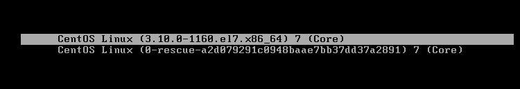
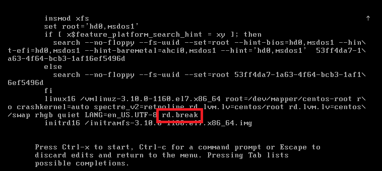
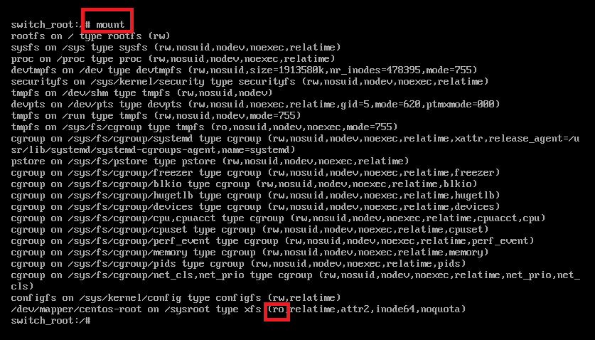
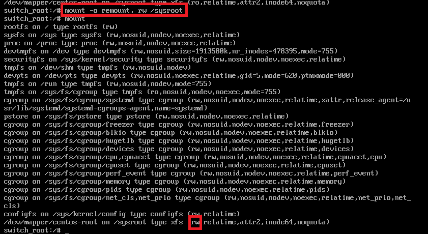
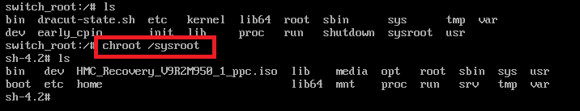
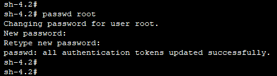
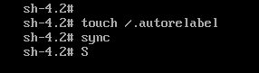
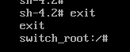
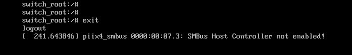

在Linux系统中，root用户拥有最高权限，能够执行系统上的所有操作。然而，如果不慎忘记了root密码，将会导致许多工作无法进行。本文将详细介绍如何通过重启系统来重置root密码。
# 1. 如果有superuser用户，可以直接登录，然后sudo
如果您的系统中存在具有sudo权限的用户，重置密码将会变得非常简单。
使用具有sudo权限的用户（如accountA）登录系统。
执行sudo -i或su - root命令，获取root用户的shell。
现在您可以使用passwd命令来修改root密码。
# 2. 如果没有superuser用户，就需要重启系统来重置root密码
如果没有可用的superuser用户，您需要通过以下步骤来重置root密码：
## 2.1 重启系统
首先，您需要重启您的Linux系统。
## 2.2 在启动到bootloader的时候(如下图)按上下键，或w键，取消倒计时
在系统启动过程中，当出现启动菜单（bootloader）时，使用键盘的上下键或按w键取消自动倒计时。

## 2.3 按e键编辑启动配置
按e键进入编辑模式，找到以linux16开头的行。
将光标移动到该行的末尾，添加rd.break参数。这个参数会让系统在从initramfs移交到实际系统前中断。
按下Ctrl + X，使用所做的更改启动

## 2.4 查看/sysroot挂载方式
使用mount命令查看/sysroot的挂载方式。通常情况下，/sysroot应该是以只读模式挂载的。

## 2.5 重新挂载/sysroot为读写模式
执行mount -o remount,rw /sysroot命令，将/sysroot以读写模式重新挂载。
```shell
# mount -o remount,rw /sysroot 命令将以读写形式重新挂载/sysroot
```

## 2.6 切换根文件系统
使用chroot /sysroot命令切换到根文件系统。
```shell
chroot /sysroot
```

## 2.7 修改密码
现在您可以使用passwd root命令来修改root用户的密码。
```shell
# passwd root
```

## 2.8 更新SELinux的文件上下文
如果您的系统使用SELinux，使用touch /.autorelabel命令标记所有未标记的文件，以便SELinux重新计算文件的上下文
```shell
touch /.autorelabel
```

## 2.9 退出并重启
第一个exit退出 chroot存放位置，第二个exit命令退出initramfs调试shell
```shell
sh-4.2# exit
exit
```

```shell
switch_root:/# exit
logout
```

# 总结
通过上述步骤，即使在没有superuser权限的情况下，您也能够成功重置Linux系统的root密码。这不仅是一种实用的技能，也是系统管理员必须掌握的基本操作之一。记住，合理管理用户权限和密码是保证系统安全的关键。
希望这篇文章能够帮助您解决忘记root密码的问题。如果您有任何疑问或需要进一步的帮助，请随时联系我们。

# 更多内容请参见本系列其他文章
<<Linux诊断和故障排除系列(一) -- 修复启动分区>>
<<Linux诊断和故障排除系列(二) -- 修复内核服务>>
<<Linux诊断和故障排除系列(三) -- 重置root密码>>
<<Linux诊断和故障排除系列(四) -- 修复文件系统>>
<<Linux诊断和故障排除系列(五) -- 修复iSCSI>>
<<Linux诊断和故障排除系列(六) -- 修复软件包及管理器>>
<<Linux诊断和故障排除系列(七) -- 应用程序诊断>>
<<Linux诊断和故障排除系列(八) -- 网络问题诊断>>
<<Linux诊断和故障排除系列(九) -- 身份验证和授权问题诊断>>
<<Linux诊断和故障排除系列(十) -- 硬件问题日志>>
<<Linux诊断和故障排除系列(十一) -- dump设置和分析>>
<<Linux诊断和故障排除系列(十二) -- 日志持久化和转发>>
<<Linux诊断和故障排除系列(十三) -- 官方支持数据sos_report及其分析可视化软件>>

本文内容为原创，如需转载，请务必注明原文出处。
更多相关内容，欢迎访问我的个人网站：hongxu.wang。
我们还提供免费的技术支持，欢迎与我们联系。
