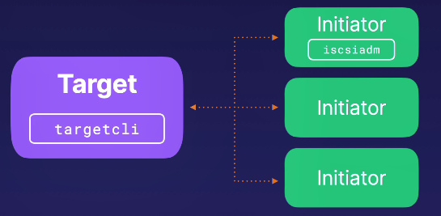

iSCSI（Internet Small Computer System Interface）是一种将数据存储设施连接到网络的存储协议，它允许存储设备在IP网络上像直连存储一样被访问。构建一个iSCSI环境至少需要两台服务器：一台作为Target（存储目标），另一台作为Initiator（存储发起者）。以下是配置和诊断iSCSI环境的详细步骤：
# 1. iSCSI 环境配置
安装必要的软件：
在Target服务器上安装targetcli，这是一个基于CLI的配置和管理工具，用于iSCSI Target。
在Initiator服务器上安装iscsiadm，这是一个用于管理iSCSI连接的命令行工具。
配置Target：
使用targetcli在Target上设置iSCSI存储卷，并配置网络参数，如端口号等。
配置Initiator：
使用iscsiadm在Initiator上发现并连接到Target，建立iSCSI会话。
一对一连接：
虽然可以有多个Initiators，但每个Initiator与Target的连接是一对一的。

# 2. 诊断iSCSI问题
## 2.1 诊断Target
检查服务状态：
systemctl status target
确认iSCSI Target服务正在运行。

检查配置：
iscsi/iqn.../tpg1/portal
检查Target的配置信息，包括端口号等网络参数。

检查访问控制列表（ACL）：
iscsi/iqn.../tpg1/acls
确保Initiator有权访问Target。

## 2.2 诊断Initiator
检查端口连接：
telnet 3260
使用telnet检查3260端口是否开放，这是iSCSI协议默认使用的端口。

检查会话状态：
iscsiadm -m session
查看当前活动的iSCSI会话。

发现Target：
iscsiadm -m discovery -t sendtargets -p :3260
发现网络上可用的iSCSI Targets。

管理iSCSI节点：
iscsiadm -m node -o delete
删除并重新创建iSCSI节点，以解决连接问题。

# 3. 最佳实践
定期检查iSCSI环境的日志文件，以便及时发现并解决问题。
确保所有iSCSI相关服务和软件都是最新版本，以利用最新的安全补丁和性能改进。
在配置更改后，进行彻底的测试，以确保iSCSI环境的稳定性和可靠性。
通过遵循上述步骤和最佳实践，您可以确保iSCSI环境的配置正确，并在遇到问题时能够迅速进行诊断和修复。

# 更多内容请参见本系列其他文章
<<Linux诊断和故障排除系列(一) -- 修复启动分区>>
<<Linux诊断和故障排除系列(二) -- 修复内核服务>>
<<Linux诊断和故障排除系列(三) -- 重置root密码>>
<<Linux诊断和故障排除系列(四) -- 修复文件系统>>
<<Linux诊断和故障排除系列(五) -- 修复iSCSI>>
<<Linux诊断和故障排除系列(六) -- 修复软件包及管理器>>
<<Linux诊断和故障排除系列(七) -- 应用程序诊断>>
<<Linux诊断和故障排除系列(八) -- 网络问题诊断>>
<<Linux诊断和故障排除系列(九) -- 身份验证和授权问题诊断>>
<<Linux诊断和故障排除系列(十) -- 硬件问题日志>>
<<Linux诊断和故障排除系列(十一) -- dump设置和分析>>
<<Linux诊断和故障排除系列(十二) -- 日志持久化和转发>>
<<Linux诊断和故障排除系列(十三) -- 官方支持数据sos_report及其分析可视化软件>>

本文内容为原创，如需转载，请务必注明原文出处。
更多相关内容，欢迎访问我的个人网站：hongxu.wang。
我们还提供免费的技术支持，欢迎与我们联系。