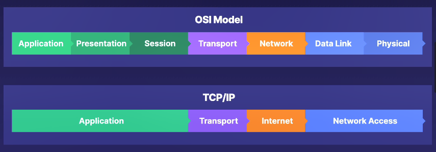

# 1. 网络概述
## 1.1 OSI和TCP/IP模型
有2种网络模式：OSI和TCP/IP
OSI：
Applicatoin: 应用层，例如httpd/ssh
Presentation: 展示层，为应用处理所有的格式化和编码解码
Session: 会话层，应用层建立连接及期需要的东西
Transport: 传输层，处理数据包的分割，以及TCP/UDP的发包
Network: 网络层，处理网络中的路由的问题
Data Link: 数据链路层，处理处理MAC地址
Physcial: 物理层，物理布线等网络设备

TCP/IP：
Application: OSI中的Applicatoin+Presentation+Session
Transport: OSI中的Transport
Internet: OSI中的Network
Network Access: OSI中的Data Link+Physcial

## 1.2 数据是如何传输的
第一步：应用的数据包通过Applicatoin、Presentation、Session；
第二步：在Transport被分割为很多小包；
第三步：这些小包通过Network进行路由；
第四步：然后进入Data Link、Physcial，也就是网线上传输。

# 2. 验证网络连通性
## 2.1 工具
ping 通过发包来检查连接性，并记录包的丢失率和响应时间。还可以用ping做压力测试
telent 通过自定义的端口来打开一个TCP连接
ncat(nc) 测试TCP、UDP、listen
## 2.2 ping
ping不能指定端口
```shell
//在服务器A上(172.31.111.108)：
$ dnf reinstall httpd -y
$ systemctl enable --now httpd
$ curl localhost
//在服务器B上：
$ ping 172.31.111.108
$ ping 172.31.111.108 -c 5			//ping 5次
$ ping 172.31.111.108 -f				//基于压力测试来测试连接的可靠性，这会用数据包来flood服务器，来看服务器的反应，用Ctrl+c结束
$ ping 172.31.111.108 -s 1024		//指定数据包的大小
```
## 2.3 telnet
telnet只能检查TCP连接
```shell
$ dnf install telnet -y
$ telnet 172.31.101.193 80      //通过Telnet来测试端口
Trying 172.31.101.193...
Connected to 172.31.101.193.
Escape character is '^]'.       //可以成功连接，强制退出吧
```
## 2.4 ncat(nc)
ncat(nc) 测试TCP、UDP、listen
测试TCP:
```shell
//在服务器A上(172.31.111.108)：
$ dnf install nmap-ncat -y
$ nc -l 443				//打开一个443监听端口，-l代表监听。默认使用的是TCP协议
//在服务器B上：
$ dnf install nmap-ncat -y
$ nc 172.31.111.108 443				//通过443端口连接到对方，然后发消息就会在对方屏幕上显示了
Hello                   //这时在对方屏幕上会显示Hello
                    //Ctrl+c会让两个服务器都退出nc程序    
```
测试UDP:
```shell
//在服务器A上(172.31.111.108)：
$ dnf install nmap-ncat -y
$ nc -u -l 443				//打开一个443监听端口，-l代表监听。-u代表使用UDP
//在服务器B上：
$ dnf install nmap-ncat -y
$ nc -u 172.31.111.108 443				//通过443端口连接到对方，然后发消息就会在对方屏幕上显示了
Hello                   //这时在对方屏幕上会显示Hello
                    //Ctrl+c会让两个服务器都退出nc程序    
```
# 3. 修复连接问题 
## 3.1 修复连接问题的思路
如果有连接问题，先使用ping, telnet, nc来检查一下
能否访问端口？
能否访问那个网络？
能否访问网络的其他节点？
是否有防火墙？
## 3.2 检查防火墙
```shell
$ systemctl status firewalld		//检查防火墙状态
$ dnf install firewalld
$ systemctl start firewalld 
$ firewall-cmd --list-all			//显示防火墙规则
$ systemctl status httpd			//检查httpd状态
$ curl localhost							//检查从本机能否访问httpd，一切正常
//然后从其他地方访问一下httpd，比如另一台电脑的浏览器，发现不好使
$ firewall-cmd -zone=public --add-port-80/tcp		
$ firewall-cmd -zone=public --add-service=http
$ firewall-cmd --list-all			//显示防火墙规则，这时有http了
//然后从其他地方访问一下httpd，比如另一台电脑的浏览器，一切正常了
$ firewall-cmd -zone=public --add-service=http --permanent		//永久添加，不然重启就不好使了
$ firewall-cmd --runtime-to-permanent		//将现有的配置变永久的
```
## 3.3 网络工具
bind-utils //安装这个包，获得的dig和host命令(name server相关)
ip/nmcli //显示或更新网络配置
bash-completion		//Bash shell的扩展，它提供了命令行自动补全功能。
```shell
$ cat /etc/udev/rules.d/70-persistent-net.rules			//管理网络设备名称持久性的规则文件，查看使用的网络设备等信息
$ cat /etc/resolv.conf				//查看name server 
$ dnf install bind-utils -y
$ dig duckduckgo.com				//查看使用的name server，在命令输出的最下面，有SERVER也就是name server
$ ip a 				//显示网络配置信息
$ ip address show dev eth0
$ ip a s dev eth0			//显示设备eth0信息
$ ip r s dev eth0			//显示设备eth0路由信息
$ ip r s default			//显示默认路由
$ ip r d dev eth0			//第一个d代表delete
$ ip r d default			//删除默认路由
$ ip r a default via 10.1.1.1		//添加默认路由
$ ip a a dev eth1 10.0.2.10/24	//添加地址
$ dnf install bash-completion -y	//Bash shell的扩展，它提供了命令行自动补全功能。
$ nmcli
$ nmcli device show 	//显示所有网络设备信息
$ nmcli d show 	//显示所有网络设备信息
$ nmcli connect show		//显示连接信息，和ip a差不多
$ nmcli c show
$ nmlci c show System\ eth0		//显示指定设备信息
$ nmlci c show System\ eth0	| grep dns	//显示指定设备信息，并过滤
$ nmlci c show System\ eth0	| grep ipv6	//显示指定设备信息，并过滤
```
# 4. 检查网络流量以帮助进行故障排除 
tcpdump/wireshark: 通过终端捕获网络流量。
两者非常像，都使用PCAP(Packet Capture API)抓取网络数据包；使用相同的底层库；使用相同的格式化和过滤功能。tcpdump的所有命令基本可以与tshark(wireshark的CLI)互换，他们基本有相同的标志等。
tcpdump -i eth0 -c 5 -w tcpdump.pcap
tshark -i eth0 -c 5 -w tshark.pcap
-i定义接口，-w写到自定义文件，-c定义抓取多少个数据包，-r从自定义文件读取
```shell
//在第2台服务器上：
$ watch -n 5 "curl 172.31.101.193"		//每5秒刷新一次
//在第1台服务器上：
$ dnf install tcpdump wireshark
$ tcpdump -i eth0								//抓取eth0上的所有数据(流量)
$ tshark -i eth0								//同上
$ tshark -i eth0 -c 5 -w /tmp/file.pcap		//抓取5个数据包，文件是二进制的
$ tcpdump -i eth0 -c 5 -w tcpdump.pcap      //同上
$ tcpdump -r /tmp/file.pcap			        //读取文件，代表tcpdump和tshark可以互相替换
$ tshark -i eth0 -c 5 -w /tmp/file.pcap	'port 80'		//抓取5个数据包，只抓取80端口的
$ tshark -r /tmp/file.pcap			        //读取文件
```