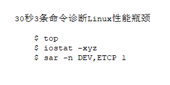
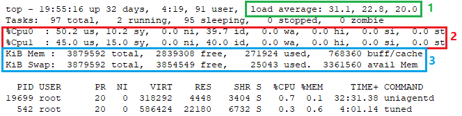
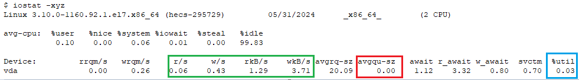
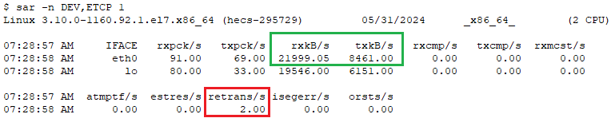

Linux性能诊断和调优系列(一) -- 30秒3条命令诊断Linux性能瓶颈

# 目录
第一条命令：top 查看整体负载、CPU、内存情况
第二条命令:  iostat -xyz  查看磁盘情况
第三条命令: sar -n DEV,ETCP 1 查看网络情况
总结及建议
# 正文
当您怀疑Linux系统可能面临性能瓶颈时，以下三条命令可在短短30秒内为您提供初步的诊断，帮助您快速定位潜在的性能问题。这将为您进一步深入分析问题并迅速解决提供坚实的基础。
## 第一条命令:  top  
### 使用top命令查看整体负载

图中的指标1load average显示了过去1分钟、5分钟和15分钟的平均负载，这些数值反映了系统内正在执行、等待CPU资源以及处于不可中断状态的进程总数。如果这些进程的数量超过了您的CPU核心数量，这可能表明系统可能正承受着较高的负载。
如果观察到平均负载呈现上升趋势，例如从10到20再到30，那么这可能意味着您的性能或负载正在恶化。现在正是收集相关数据的时机。
但是，随着时间的推移，平均负载这一指标已经发生了变化，它不再仅仅与CPU核心数量相关联，也不能简单地通过将负载除以CPU核心数来评估。它更多地作为一个宏观的参考指标，帮助我们了解系统的整体负载情况。
更详细信息和具体原因请参见我的另外两篇文章<<Linux中的load average>>和<<Linux中的load average相关代码和测试过程>>
### 使用top命令查看CPU使用情况

图中的指标2 展示了CPU的使用情况：
如果"sy"（系统CPU使用率）异常高，这可能意味着内核存在问题，比如在处理I/O请求时效率不高。这时，您可能需要检查设备驱动程序是否有bug。
如果"wa"（等待I/O的CPU时间比例）很高，这通常表明系统可能在等待磁盘I/O操作，这可能意味着磁盘存在性能瓶颈。您可能需要进一步分析磁盘相关的性能指标。
如果"us"（用户空间CPU使用率）很高，这表明CPU正在运行您的程序。只要进一步分析正在运行和等待CPU的进程数量，确保它们不超过CPU核心的数量，通常就没有问题。
此外，检查每个CPU核心的使用情况也很重要。如果只有一两颗CPU核心忙碌到接近100%，其他CPU核心相对空闲，这可能意味着程序的多进程或多线程处理不当，没有充分利用CPU的多核性能。在这种情况下，您可能需要考虑优化程序的并发设计。
CPU还和进程的调度策略、优先级，CPU的亲和性，CPU隔离有关。更多的CPU性能诊断和调优，请参见本系列的另外一篇文章<<Linux性能诊断和调优系列(二)--CPU篇>>
### 使用top命令查看内存情况

图中的指标3提供了内存和交换分区的使用情况：
先查看交换分区(Swap)的使用量与其总量的比例，如果这个比例小于5%，那么整体上您的内存使用情况还算良好。然而，如果这个比例远大于5%，这可能意味着您的物理内存已经不足以满足当前需求，系统开始频繁使用交换分区。这时，您需要进一步分析内存和交换分区的使用情况，以确定是否存在内存瓶颈。
接下来，再看"avail Mem"，这个指标显示了当前系统实际剩余的可用内存量，这是评估内存使用状况的更准确指标。
至于"free"，这个指标通常没什么用！
内存还和page fault、内存回收以及OOM有关，更多的内存和交换分区性能诊断和调优，请参见本系列的另外一篇文章<<Linux性能诊断和调优系列(三)--内存篇>>
## 第二条命令:  iostat -xyz 
### 使用iostat -xyz命令查看磁盘情况

图4展示了磁盘的使用情况：
r/s和w/s分别代表每秒的读操作次数和写操作次数。rkB/s和wkB/s则分别表示每秒的读取和写入的千字节量。如果这些指标的值异常高，可能意味着磁盘正在面临性能问题。这里的"异常高"是指超出了磁盘硬件所能提供的性能指标。
avgqu-sz表示向磁盘发送的平均请求数。如果这个数值大于1，表明磁盘可能已经达到或接近饱和状态。
%util是磁盘的使用率，也就是磁盘的繁忙程度。如果这个百分比超过60%，可能预示着性能问题的出现，这通常也会在await指标上得到体现。如果%util达到100%，这意味着磁盘在所有时间里都在处理I/O请求，处于持续忙碌状态。然而，如果磁盘是一个逻辑设备，其后端由多块物理磁盘组成(例如RAID阵列)，那么即使%util达到100%，也可能仅意味着逻辑设备在所有时间里都在处理I/O请求，而其后端的物理磁盘可能并未饱和，仍能处理更多的工作负载。
注意，由于异步I/O(AIO)的存在，磁盘性能问题并不总是与应用程序本身有关，因为应用程序可能不会直接受到磁盘性能的影响。而且，预读和写入缓冲也会对性能有所改善。
SSD、NVMe、RAID和普通机械盘都不是同的，例如TRIM。还有设备IO调度等。更多的磁盘性能诊断和调优，请参见本系列的另外一篇文章<<Linux性能诊断和调优系列(四)--硬盘篇>>
## 第三条命令: sar -n DEV,ETCP 1
### 使用sar -n DEV,ETCP 1 命令查看网络情况

图5展示了网络接口的使用情况：
rxkB/s和txkB/s分别表示网络接口每秒接收和发送的千字节数。请注意，这些单位是以字节为基准的，要转换为网络常用的比特(bit)单位，需要将这些数值乘以8。
例如，如果rxbB/s的数值是20686.42 kilobytes，那么转换为兆字节就是22 Mbyte/s，再进一步转换为兆比特则是176 Mbits/s。与1 Gbit的网络接口相比，这个速率还有很大的空间。
retrans/s，即每秒重传的数据包数量，可能是网络或服务器存在问题的一个标志。如果这个数值异常高，可能是由于网络不稳定或服务器过载导致数据包丢失，进而需要重新发送。
网络很复杂，要考虑网络带宽延迟、window scaling、Jumbo frames、TSO、网络聚合、网络内核参数的调整等。更多的网络性能诊断和调优，请参见本系列的另外一篇文章<<Linux性能诊断和调优系列(六)--网络篇>>
# 总结及建议
以上三条命令仅适用于一般情况和初步诊断，用于快速初步诊断，查看CPU、内存、磁盘、网络是否可能存在性能问题。但性能问题涉及很多方面，例如文件系统、虚拟机、容器、cgroup、tuned应用程序等。
# 更多内容请参见本系列其他文章
<<Linux性能诊断和调优系列(一)--30秒3条命令诊断Linux性能瓶颈>>
<<Linux性能诊断和调优系列(二)--CPU篇>>
<<Linux性能诊断和调优系列(三)--内存篇>>
<<Linux性能诊断和调优系列(四)--硬盘篇>>
<<Linux性能诊断和调优系列(五)--文件系统篇>>
<<Linux性能诊断和调优系列(六)--网络篇>>
<<Linux性能诊断和调优系列(七)--虚拟机及容器篇>>
<<Linux性能诊断和调优系列(八)--虚拟环境性能调优案例>>
<<Linux性能诊断和调优系列(九)--计算密集型应用性能调优案例>>
<<Linux性能诊断和调优系列(十)--存储密集型应用性能调优案例>>
<<Linux性能诊断和调优系列(十一)--大内存型应用性能调优案例>>
本文内容为原创，如需转载，请务必注明原文出处。
更多相关内容，欢迎访问我的个人网站：hongxu.wang。
我们还提供免费的技术支持，欢迎通过公众号与我们联系。