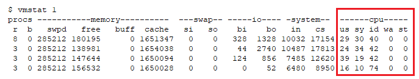
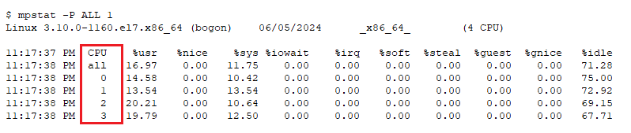
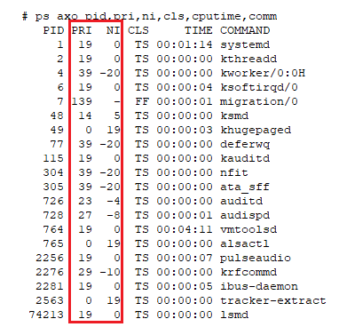
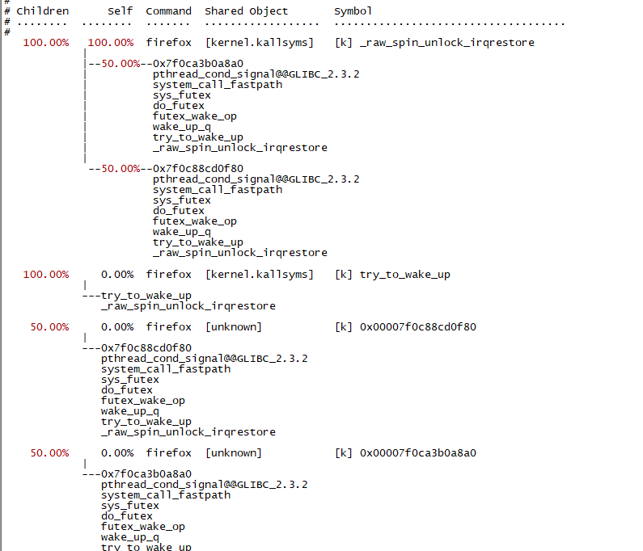
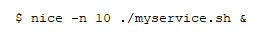
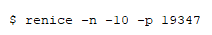
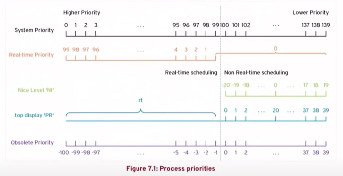

Linux性能诊断和调优系列(二) -- CPU篇

# 目录
如何查看CPU使用率？
如何调整进程优先级？
什么决定了谁能使用CPU？
CPU的调度策略都有哪些？
如何让进程获得更多CPU？
如何绑定CPU？
如何隔离CPU？
虚拟机里的CPU有什么不同？
什么是NUMA？
查看和调整CPU的常用命令
总结及建议
# 如何查看CPU使用率？
vmstat 命令查看系统级的CPU负载

mpstat 命令查看每颗CPU的使用情况

ps 命令显示进程号、进程优先级、NICE值、调度策略、使用CPU时间和进程的命令

perf 查看程序的CPU时间都花在了哪里

当然少不了火焰图，更直观更方便

# 如何调整进程优先级？
nice命令在启动新进程时设置其nice值

renice命令用于改变运行中的进程的nice值

# 什么决定了谁能使用CPU？
在Linux系统中(或者说在绝大部分操作系统中)，进程的优先级决定了哪个进程可以获得CPU的使用，进程的优先级的数值越小，其优先级就越高。
下图是进程的优先级图表

而在Linux中，可以根据进程优先级的不同，将进程分为二类：实时进程和普通进程。
实时进程的优先级绝对值从0-99，反映到命令输出就是99-1。优先级永远高于普通进程，一般只用于操作系统，例如内存的分配和进程的调度等。你也可将你的程序或进程设置为实时进程，从而获得更多CPU，但是这样太危险了！因为这样可能导致计算机的CPU只处理你的程序，而无法处理操作系统的需求(例如响应命令或鼠标等)，从而导致计算机无响应，更可能会导致关键资源或指标超时，让计算机死机(例如watchdog在规定时间内无响应，会让计算机重启)。
普通进程的优先级绝对值从100-139，反映到命令输出就是-20->+19，也就是我们的程序等，普通进程的优先级默认是0，你可以使用nice等命令来调整其优先级。普通进程的优先级是动态的，会随着CPU的使用程度而被重置，从而让每个进程都可以获得CPU。

ps命令中的pri列出static priority。rtprio列出real-time priority。ni列出nice值。cls列出scheduling policy，TS代表time-sharing，也就是non-real-time policy；FF代表FIFO，也就是real-time policy。
```shell
$ ps axo pid,pri,rtprio,ni,cls,cputime,comm		<<<<<<ps axl命令是用旧的UNIX变量显示的优先级-40(最低)到99(最高)；而ps axo是用新形式，是从0(最高优先级)到139(最低)
   PID PRI RTPRIO  NI CLS COMMAND
     4  39      - -20  TS kworker/0:0H
     6  19      -   0  TS ksoftirqd/0
     7 139     99   -  FF migration/0
```
# CPU的调度策略都有哪些？
## 对于实时进程，CPU的调度策略三种：
第一种是先进先出，抢到就运行，直到被IO中断或被更高优先级的抢占或自己让出CPU，这也是我不让你将你的程序设置为实时进程的原因之一，因为它真的太强了！
第二种是轮询，所有相同优先级的进程依次轮询使用CPU，这也很夸张，因为可能会导致低优先级的进程(例如普通进程)基本无法获得CPU的使用时间而饿死。
第三种是dealline，任务必须在特定时间期限内完成，总之很强大！
## 对于普通进程，在Linux kernel在2.6.23引入CFS后，对应CPU的调度策略三种：
第一种是普通，就是最普通的了。
第二种是BATCH，适合批处理处理，优先级低，但是会长期占用CPU的。
第三种是IDLE，其nice值低于19，适合低优先级的，例如那些可以等CPU闲下来再运行的进程。
# scheduling policies的kerenel参数
在/proc/sys/kernel 文件夹中
sched_latency_ns	: 多少ns内，Q里的tasks必须被调度一次。增加这个值会增加CPU绑定进程的时间片
sched_min_granularity_ns : 最小运行CPU时间片(ns)，这个值必须比上一个值小
sched_migration_cost_ns  : 在被迁移到另一个CPU以前，在CPU上执行的最小时间(ns)。增加这个值会降低进程在CPU间移动
sched_rt_period_us	    : real time的最小CPU运行的时间片(us)。默认值是CPU的100%带宽	<<<<<<这个很重要
sched_rt_runtime_us	    : 在每个sched_rt_period_us中，real-time tasks可用的最大CPU时间(us)
	默认的sched_rt_period_us是1s，sched_rt_runtime_us是0.95s，这样就有了0.05s用于non-real-time，从而预防real-time完全占用了CPU，这个机制也叫real-time scheduler throttling
# 如何让进程获得更多CPU？
nice命令用于在启动新进程时设置其nice值，也就是相对优先级，范围 -20到+19，例如下面的命令会将your_process进程以优先级10来启动
$ nice -n 10 your_process &
renice命令用于改变运行中的进程的nice值，也就是相对优先级，
例如下面的命令会将进程PID为1234的进程的nice值调整为-10
$ renice -n -10 -p 1234 
还可以使用tuna或systemd来设置策略和优先级
# 修改进程的优先级
chrt - manipulate the real-time attributes of a process
```shell
# chrt -m	<<<<<<显示可调的最大和最小值
# chrt -d --sched-runtime 5000000 --sched-deadline 10000000 --sched-period 16666666 0 simple_task		<<< -d表明用SCHED_DEADLINE policy
# chrt -p 1234		<<<<<<查看进程1234的调度策略和优先级
# chrt -f 38 /bin/simple_task	<<<<<< -f使用FIFO，38是优先级。使用chrt启动一个进程，默认使用RR策略
```
一个程序可以使用sched_setscheduler()和sched_getscheduler()系统调用来设置和获得scheduling policy和real-time priority
# 如何绑定CPU？
kernel决定进程在哪个CPU上运行，当然一个进程可能会运行在多个CPU上，因为进程会中断很多次，每次中断后就可以会被调度到不同CPU上。但是对于一些进程(例如内存密集型进程)，让进程运行在特定1个或2个CPU上，这样会增加cache命中率，从而增加整体程序的性能。
在Linux中systemd的配置文件里的[Service]里的CPUAffinity可以设定这个service可以运行的CPU列表，第一个CPU是cpu 0，第二个CPU是1。""代表全部CPU
[Service]
CPUAffinity=""
# 如何隔离CPU？
cpu-partitioning-variables.conf文件可以配置将CPU分区，即将一些CPU划到只处理特定的进程。
例如，其中参数isolated_cores是将强制隔离的CPU列出来，从而剩余的CPU就会处理其他任务。
中断会降低性能，我们可以让一个CPU专门来处理中断，从而进一步提高性能。
在文件夹/proc/irq/中，有很多数字的文件夹，这里的每一个数字文件夹对应的就是中断请求号。而其中的smp_affinity文件就是让哪个CPU处理对应中断，1代表对应的CPU可以处理这个中断，0代表这个CPU不处理这个中断。
例如，想让中断24只在在CPU 0，1处理可以用以下命令：
$ echo 3 > /proc/irq/24/smp_affinity
# 虚拟机里的CPU有什么不同？
虚拟机的CPU是作为宿主机的用户态的进程运行的，所以虚拟机的CPU可以指定宿主机的物理CPU，从而增加性能，因为这样会增加cache的命令率，减少内存额外访问。
可以使用virsh vcpupin命令来设置虚拟CPU和物理CPU的依附性(在KVM、Xen、LXC等环境中)
查看虚拟CPU和物理CPU的依附性：
$ virsh vcpupin rhel8-demo 
设置CPU依附性：
$ virsh vcpupin rhel8-demo 0 0
# 什么是NUMA？
NUMA，Non-Uniform Memory Access，非一致性内存访问，是一种计算机设计架构。在NUMA架构中，CPU有独立的本地内存，与传统UMA/SMP架构对比，最大的不同之处是出现了本地内存和远程内存。
现在绝大多数服务器是NUMA架构的，对于NUMA，你只需要知道每颗CPU独立连接到一部分内存，这部分CPU直连的内存称为“本地内存”；而其他不和自己直连的内存称为“远程内存”。访问本地内存的速度比访问其他CPU的“远程内存””要快。
# 查看和调整CPU性能的常用命令
vmstat        查看系统级CPU平均负载。
mpstat        查看每颗CPU的使用情况。
ps/top        查看每个进程的CPU使用情况和进程优先级。
pidstat        查看每个进程的CPU详细使用情况。
cpudist        显示每个线程的CPU使用情况。
sar -P ALL    显示每颗CPU的使用情况。
time            测量命令/程序的运行时间和各项详细信息。
ltrace            追踪程序执行时的库函数调用。
strace           追踪程序执行时的系统调用。
slabtop         显示 SLAB 分配器的情况
perf              系统级性能分析工具。
bpftrace       基于 eBPF的高级跟踪工具，可以写脚本来监控和分析程序的CPU详细使用情况。
nice              在启动新进程时设置其nice值
renice           改变运行中的进程的nice值
# 总结及建议
使用top, vmstat, mpstat, ps, pidstat, cpudist, time等命令查看和分析CPU使用情况，然后根据CPU使用情况来进行下一步分析。
不要修改CPU相关参数！！！现代操作系统已经对CPU方面进行了优化，通常无需额外干预。
不要将你的程序设置为实时进程！！！这样你的程序虽然可以提升优先级，获得了更多的系统资源和响应速度，但同时也极大地增加了系统崩溃的风险。
除非你真的完全知道你在做什么，并且清楚响应的影响，否则不建议调整CPU相应参数。
PS：关于CPU使用率高，人们持有不同的观点。一些人认为CPU使用率高是好事，因为这意味着投入的资金正在得到有效的利用，CPU正在全力以赴地工作。而另一些人则相反，担心CPU使用率过高可能会导致资源不足，从而影响电脑的性能和稳定性。你怎么看？
# 更多内容请参见本系列其他文章
<<Linux性能诊断和调优系列(一)--30秒3条命令诊断Linux性能瓶颈>>
<<Linux性能诊断和调优系列(二)--CPU篇>>
<<Linux性能诊断和调优系列(三)--内存篇>>
<<Linux性能诊断和调优系列(四)--硬盘篇>>
<<Linux性能诊断和调优系列(五)--文件系统篇>>
<<Linux性能诊断和调优系列(六)--网络篇>>
<<Linux性能诊断和调优系列(七)--虚拟机及容器篇>>
<<Linux性能诊断和调优系列(八)--虚拟环境性能调优案例>>
<<Linux性能诊断和调优系列(九)--计算密集型应用性能调优案例>>
<<Linux性能诊断和调优系列(十)--存储密集型应用性能调优案例>>
<<Linux性能诊断和调优系列(十一)--大内存型应用性能调优案例>>

本文内容为原创，如需转载，请务必注明原文出处。
更多相关内容，欢迎访问我的个人网站：hongxu.wang。
我们还提供免费的技术支持，欢迎通过公众号与我们联系。