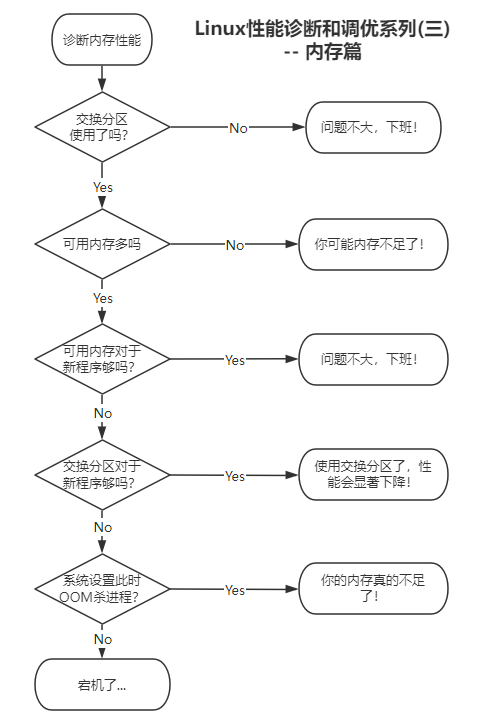
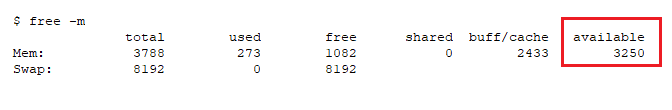
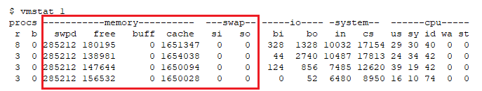
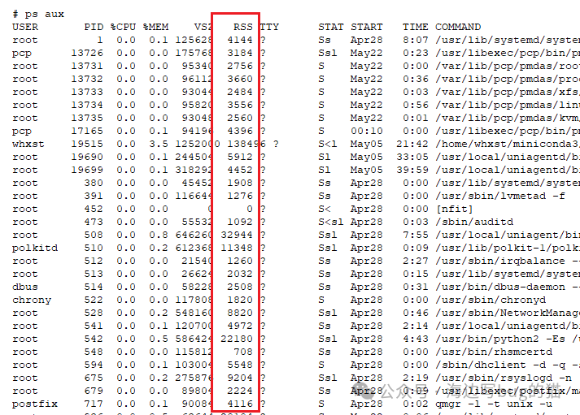
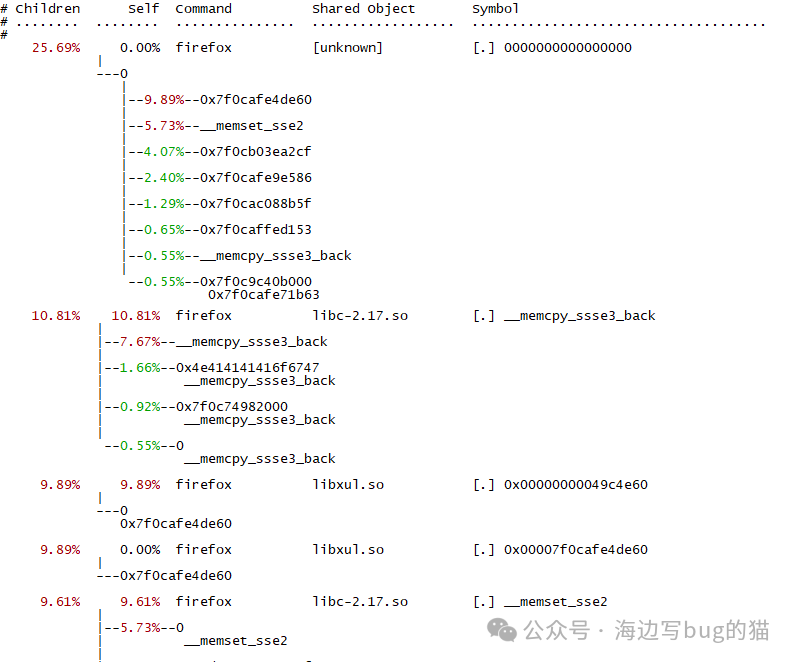

Linux性能诊断和调优系列(三) -- 内存篇

# 目录
如何查看内存使用率？
内存的意义是什么？
交换分区的大小设置多大好？
TLB和Huge Page
Bypass和裸设备
内存和交换分区都用光了会怎么样？
进程的badness得分是干嘛的？
如何让我的程序不被操作系统杀死？
如何绑定内存？
什么是内存超发？
内存泄漏？
总结和建议
# 如何查看内存使用率？
free 命令输出中的available是当前可用内存容量

vmstat查看内存和交换分区的使用情况

ps命令输出中的rss是一个进程当前实际使用的物理内存的容量。

pmap命令查看进程的内存映射详细信息

perf命令查看进程缺页详细信息

进程缺页火焰图

# 如何限制内存使用量？
可以通过cgroup来限制使用多少内存，例如memory.limit_in_bytes。
可以使用systemctl命令或编辑service的文件来限制内存使用量。
$ cat sshd.service
[Service]
MemoryLimit=1073741824
# 内存的意义是什么？
内存的意义就是尽量不去读硬盘！因为从内存读写数据和从硬盘读写数据，二者相差100倍。所以如果你的内存使用率接近100%，这说明不了什么。要看可用内存剩余多少，和交换分区的使用率。
可用内存是如果有需要，操作系统可以马上"还给你"的内存容量，也就是操作系统向你借了这些内存容量用于缓存一些数据达到计算机运行更快而已，反正这些内存你现在也用不着。
交换分区就真的是你内存用光了，所以只好把内存中一部分现在没有使用的数据，先放到交换分区(硬盘)上了！等用的时候，再从硬盘读回来。所以如果交换分区使用率过高(例如10%)，那会明显降低计算机性能，说明你需要扩充内存容量了！
# 交换分区的大小设置多大好？
总有人说我内存很大，要不要设置交换分区？建议你交换分区一定要设置，只不过是设置多大的问题。因为交换分区是你内存用光时，可以"交换"的地方，如果没有交换分区，你的内存又用光了，那只能是有进程被杀死(后面会讲到)或死机！
那交换分区设置多大？建议如下：

PS1：如果你有非机械硬盘(例如SSD)，一定要把交换分区设置到非机械硬盘上！
PS2：你自己使用的电脑也一样的道理，但是这里有一点要注意的是，如果你的电脑内存不小于64G，那建议你就不要打开电脑的休眠功能了，因为以现在的硬盘速度来讲，从休眠恢复的时间要比你开机的时间还要慢！
# TLB和Huge Page
TLB(Translation Lookaside Buffer)是一个硬件，用于维护进程的内存到物理内存的映射(其实你不用管这个)。
Huge Page就是很大的页。Linux默认的内存页是4kB，这对于内存需求量很大程序来说，分配内存就要花很多时间！于是操作系统都支持更大的内存页来提供大内存的使用场景的性能。Linux支持2MB和1GB的大页，这样分配和使用起来就会快很多！但是要使用这样的大页，需要使用对应的系统调用(例如shmget)，但这是开发人员需要关心的事。
THP(Transparent Huge Page)是操作系统自己管理的大页，和普通的Huge Page不同，THP可以由操作系统自己搞定一切，这样就很省心是不？
# Bypass和裸设备
有一些程序会绕过操作系统的的IO缓存机制，自己去管理其进程的缓存，所以叫Bypass，则这种访问磁盘就叫裸设备，最典型的例子是数据库。所以，在数据库场景中，建议你关闭THP，因为数据库根本不用它！对于数据库场景，建议调整vm.nr_hugepages来设置NUMA的huge page。
# 内存和交换分区都用光了会怎么样？
如果内存和交换分区都用光了，那么会杀进程，当然也可能会死机，具体看操作系统参数设置。
vm.panic_on_oom这个参数控制了在内存和交换分区都用光了的时候，是死机还是杀进程。当然还是杀进程的好，毕竟内存泄露嘛，你懂的。
# 进程的badness得分是干嘛的？
进程的badness得分是用于在操作系统杀进程时选杀哪个的，得分越高，越可能被杀死。当然内核本身和1号进程是对此免疫。
/proc/PID/oom_score 是进程的badness得分。
# 如何让我的程序不被操作系统杀死？
/proc/PID/oom_score_adj，这个文件可以调整进程的oom_score 值，范围是 -1000到+1000，零是默认值，-1000代表免疫，OOM killer不会杀这个进程。
# 如何绑定内存？
在上一篇我们说过NUMA，对于每颗CPU有“本地内存”和“远程内存”之分，访问本地内存的速度比访问其他CPU的“远程内存””要快。在Linux中，把系统分成node，每个node有自己的CPU和自己的本地内存。
使用numactl可以将程序绑定在特定node上，从而提升性能。
下面的命令是将程序myprogram的内存绑定在node2上，操作系统会尽可能的使用node2的内存。
```shell
# numactl  --preferred=2 -- myprogram 
```
# 什么是内存超发？
内存超发是指操作系统可以分配的内存容量超过了你物理内存与交换分区的总容量。这是因为程序通常会不使用分配它们的所有内存(和存储的瘦供给类似)，从而允许运行更大、更多的程序，从而提高系统的整体性能和资源利用率。
vm.overcommit_memory这个参数决定了内存超发的行为：
0：启发式算法。如果一个进程需要明显太多的内存，就拒绝；但会同意大量的小内存请求，从Linux6开始这个是默认值。
1: 永远超发内存，永远分配内存，不管还有多少剩余。
2: 严格控制内存超发，默认只超发交换分区的150%。
# 内存泄漏？
首先要分清内存泄露和内存增长。程序可能会使用大量内存，而这只是程序把数据从磁盘读到内存的正常行为。而分配过的内存没有释放，则是需要修复的bug。
内存泄漏的分析依赖于软件和编程语言。最简单的办法是查看内存的异常增长和内存分配器(如glibc,slab等)。常见的内存泄漏分析软件有：
Valgrind最常用的memcheck
Linux的SystemTap
当然少不了ebpf工具集，有memleak，mmapsnoop等。
还有bpftrace和perf一样万能
# 总结和建议
1. free 命令输出中的available是当前可用内存容量
2. vmstat命令输出中的si和so是交换分区的使用信息统计，如果不为零则代表正在使用交换分区。特别是si，如果一直高，那内存性能很不好！
3. ps命令中的rss是程序的实际使用内存量。
4. 使用perf分析内存性能问题，重点关注major fault，它比minor要慢一个数据级。
5. 对于数据库应用，如果内存不均衡，可能会导致性能变差，所以建议使用所有node上的内存。
6. 对于容器和实例集群，可以考虑把OOM设置为直接panic，这样在内存用光时，会把应用自动分配到集群中资源更多的池中。
7. vm.panic_on_oom这个参数控制了在内存和交换分区都用光了的时候，是死机还是杀进程。
8. 进程的badness得分是用于在操作系统杀进程时选杀哪个的，得分越高，越可能被杀死。可以修改这个值让程序不被杀。
# 更多内容请参见本系列其他文章
<<Linux性能诊断和调优系列(一)--30秒3条命令诊断Linux性能瓶颈>>
<<Linux性能诊断和调优系列(二)--CPU篇>>
<<Linux性能诊断和调优系列(三)--内存篇>>
<<Linux性能诊断和调优系列(四)--硬盘篇>>
<<Linux性能诊断和调优系列(五)--文件系统篇>>
<<Linux性能诊断和调优系列(六)--网络篇>>
<<Linux性能诊断和调优系列(七)--虚拟机及容器篇>>
<<Linux性能诊断和调优系列(八)--虚拟环境性能调优案例>>
<<Linux性能诊断和调优系列(九)--计算密集型应用性能调优案例>>
<<Linux性能诊断和调优系列(十)--存储密集型应用性能调优案例>>
<<Linux性能诊断和调优系列(十一)--大内存型应用性能调优案例>>

本文内容为原创，如需转载，请务必注明原文出处。
更多相关内容，欢迎访问我的个人网站：hongxu.wang。
我们还提供免费的技术支持，欢迎通过公众号与我们联系。