Linux性能诊断和调优系列(四) -- 硬盘篇
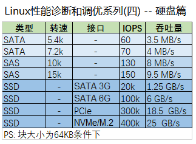
# 目录
如何查看硬盘性能？
市场上的硬盘有哪几种？需要关注什么？
操作系统看到的硬盘有哪几种？需要关注什么？
操作系统磁盘的边界在哪里？
什么决定了我的IO执行顺序？
IO调度器
修改IO调度器策略
IO优先级
修改进程的IO优先级
如何测试磁盘?性能？
SSD和普通机械硬盘的区别
总结和建议
# 如何查看硬盘性能？
iostat 查看磁盘每秒读取、写入数据量和总共读取、写入的KB数。
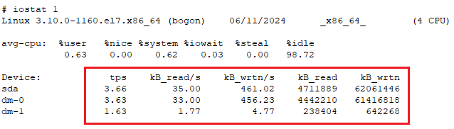
iostat 的-x参数提供详细输出，包括工作负载的IOPS和吞吐量等。
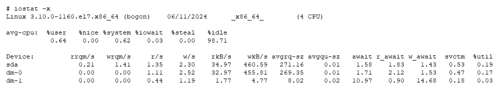
pidstat 的-d参数查看每个进程的磁盘IO的统计信息。
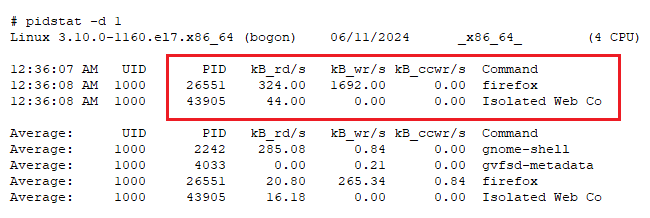
perf 工具来追踪块设备的系统级的每个事件，包括进程名、CPU、时间、事件名、磁盘设备号和IO的类型、大小等。
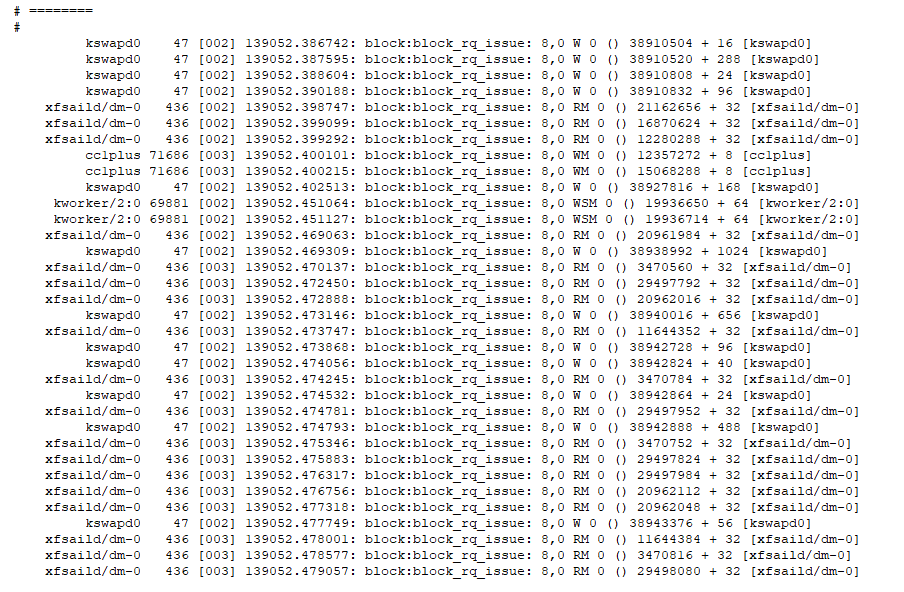
btrace通过系统调用来获取块设备数据，显示块设备队列及每个事件，有设备编号、CPU ID、活动时间、进程ID、事件类型和IO标识等。
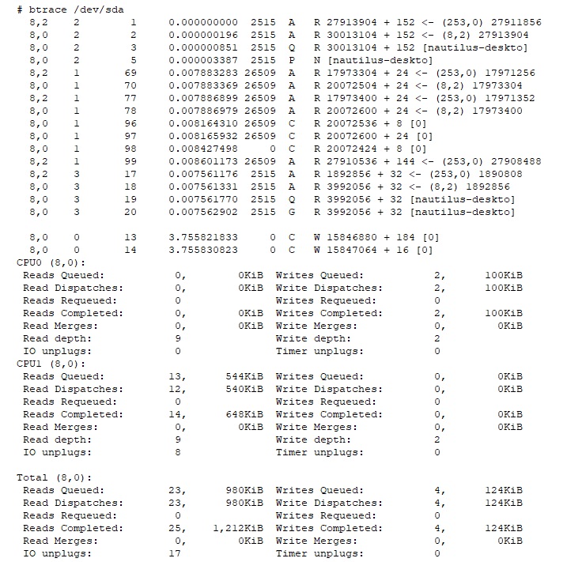
# 市场上的硬盘有哪几种？需要关注什么？
传统的机械硬盘：关注转速、数据传输率、容量、缓存、接口类型。
固态磁盘：关注闪存类型(SLC、MLC、eMLC、TLC、QLC、V-NAND)，寿命。
持久性内存：速度比闪存高好几个数量级，接近内存的速度，而且是非易失性的，以Optane为代表的新贵。关注兼容性、操作系统是否支持、质量。
# 操作系统看到的硬盘有哪几种？需要关注什么？
普通磁盘：例如服务器内置磁盘，关注点和市场上的硬盘一样。
RAID：关注RAID类型、冗余度、重建时长。
存储阵列：一般通过FC卡连接到外部存储阵列，关注IOPS和吞吐量、多路径的冗余、可观测性。
网络存储：通过网络连接到操作系统，支持NFS、SMB/CIFS、iSCSI，关注IOPS和吞吐量、可观测性。
# 操作系统磁盘的边界在哪里？
对于Linux磁盘的性能诊断和调优，其边界是操作系统管理的软硬件。
常见的是磁盘调度算法、IO队列深度、IO优先级、服务器存储卡驱动及参数，和服务器内置磁盘参数。
而外部存储和网络存储，其性能、参数、可观察性等，都需要由外部存储和网络存储才能提供，而且只能由其调整的，操作系统一般是无能为力的。
# 什么决定了我的IO执行顺序？
由IO调度器和IO优先级决定了哪个IO会先执行。
# IO调度器
RHEL8支持多个队列的I/O调度器，从而允许将I/O操作映射到不同队列，从而并行执行。
mq-deadline: 使用2个队列(一写、一读)并根据过期时间排序，从而确保I/O操作在其过期前执行。如果快接近过期时间，则在第3个队列中执行。在RHEL8这个是默认的。
kyber: 根据性能调整读写队列长度，以满足写延迟。使用2个队列来支持更快速的设备，1个是同步读，1个是异步写。
bfq: CFQ的增强版，为每个执行磁盘IO的进程创建一个队列，提供了一致的交互响应。
non: 不排队。支持像NVMe的快速随机I/O设备，但不重新排序I/O请求。这是noop的替代。
# 修改IO调度器策略
cat /sys/block/vda/queue/scheduler 查看当前IO调度器策略
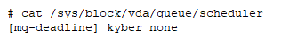
echo kyber > /sys/block/vda/queue/scheduler 修改当前IO调度器策略
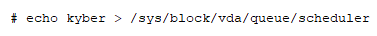
# IO优先级
有四类优先级：
none：默认，无。
ilde：空闲调度，策略是在系统没有其他进程需要进行磁盘IO时，才能进行磁盘。
Best effort：最高效策略，默认的策略；该策略可以指定优先级参数，范围是0~7，数值越小，优先级越高。同等优先级的进程采用轮询策略。
Real time：实时调度策略，无论操作系统中是否有其他进程使用磁盘，该进程立刻使用磁盘，此策略可能会使得其他进程处于等待状态！
# 修改进程的IO优先级
ionice -c 2 -n 3 -p 19515  修改进程的IO优先级
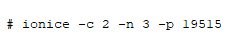
ionice -p 19515 查看进程的IO优先级
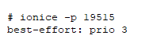
# 如何测试磁盘性能？
除了传统的dd，还可以使用以下工具：
ioping 用于测试磁盘，和网络的ping差不多。
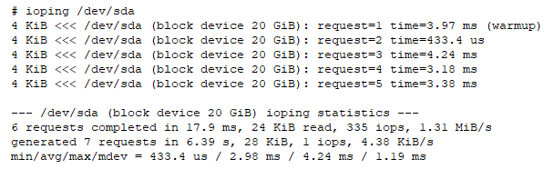
haparm可以查看和修改多种磁盘参数，这个工具太过底层，在其手册中大多被标记为"危险"，因为可能会导致数据丢失！
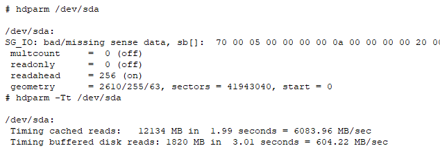
# SSD和普通机械硬盘的区别
SSD已经逐渐取代机械硬盘，对于机械硬盘的传统调优方法并不适用于SSD，例如SSD不需要预读和后写，所以建议SSD配置为直写。
同时，也不推荐在SSD硬盘上使用文件系统的日志，这会会导致不必要的两次写入，从而增加SSD的磨损和性能的缓慢。
# 总结和建议
1. 操作系统或服务器之外的RAID、存储阵列、NAS等，不是系统性能分析和调优的范围。
2. 使用IO调度器和IO优先级决定了IO的执行顺序。
3. 使用iostat, pidstat等命令查看磁盘性能。
4. 使用perf, btrace等命令分析磁盘详细事件。
5. 使用ioping等命令测试磁盘。
6. SSD已经逐渐取代机械硬盘。
# 更多内容请参见本系列其他文章
<<Linux性能诊断和调优系列(一)--30秒3条命令诊断Linux性能瓶颈>>
<<Linux性能诊断和调优系列(二)--CPU篇>>
<<Linux性能诊断和调优系列(三)--内存篇>>
<<Linux性能诊断和调优系列(四)--硬盘篇>>
<<Linux性能诊断和调优系列(五)--文件系统篇>>
<<Linux性能诊断和调优系列(六)--网络篇>>
<<Linux性能诊断和调优系列(七)--虚拟机及容器篇>>
<<Linux性能诊断和调优系列(八)--虚拟环境性能调优案例>>
<<Linux性能诊断和调优系列(九)--计算密集型应用性能调优案例>>
<<Linux性能诊断和调优系列(十)--存储密集型应用性能调优案例>>
<<Linux性能诊断和调优系列(十一)--大内存型应用性能调优案例>>

本文内容为原创，如需转载，请务必注明原文出处。
更多相关内容，欢迎访问我的个人网站：hongxu.wang。
我们还提供免费的技术支持，欢迎通过公众号与我们联系。
