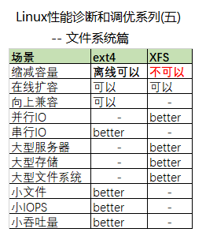
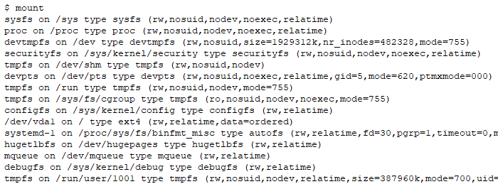
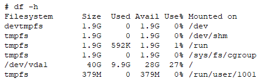
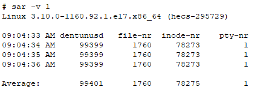
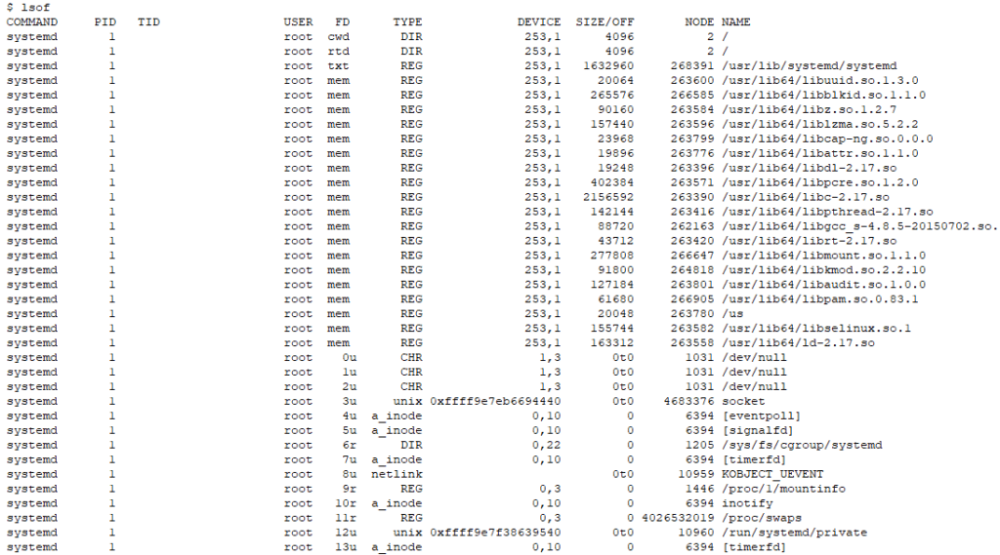
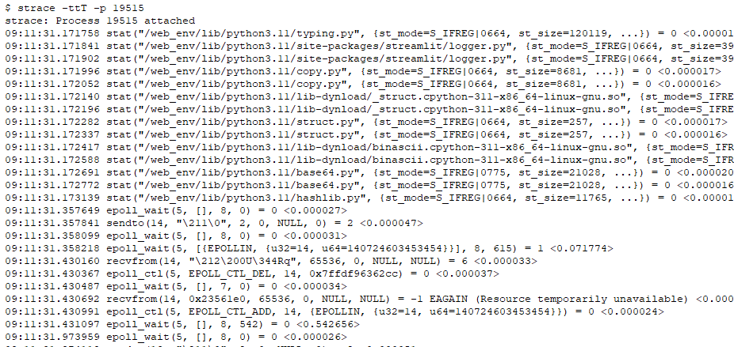
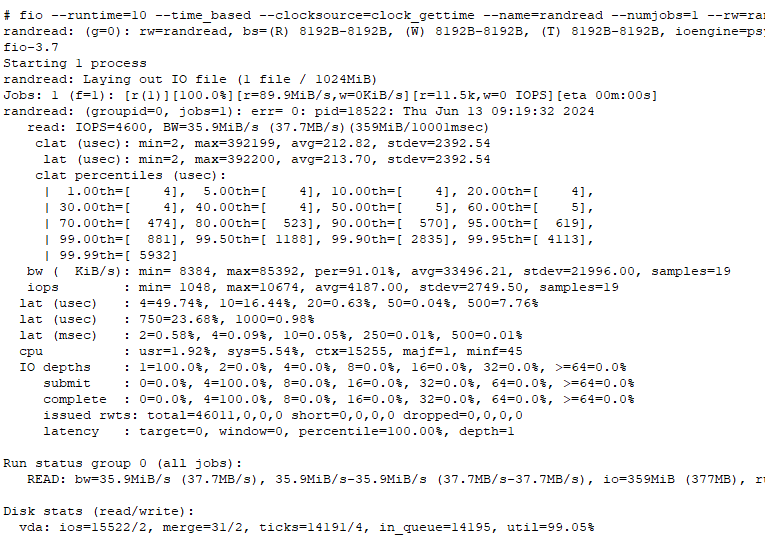

Linux性能诊断和调优系列(五)--文件系统篇

# 目录
如何查看文件系统？
ext4好还是xfs好？
使用xfs时的建议优化
使用ext4时的建议优化
关闭atime选项来提高性能
如何测试文件系统性能？
SSD和TRIM
ext4的日志模式选择
barriers和掉电后的数据恢复
总结和建议
# 如何查看文件系统？
mount 命令列出挂载的文件系统及其挂载选项

df命令显示文件系统的使用情况

sar 命令列出可用目录项、使用中的文件句柄数、使用中的inode数和伪终端数

lsof 命令显示打开中的文件

strace 命令可以显示进程的文件系统底层的详细操作时间

# ext4好还是xfs好？
xfs支持更大，更适合大文件系统，支持多种策略，支持在线扩容。但XFS不支持缩减容量！
ext4向上兼容ext2/3，更适合单线程、单磁盘、小文件的情况。ext4也支持在线扩容，而且支持离线时缩减容量。
除非有明确的需求，否则推荐使用xfs。
# 使用xfs时的建议优化
对于xfs常用的使用场景，可以通过以下修改来增加性能。
xfs的inode大小默认是256，建议修改为512。
xfs的目录大小默认是4096，建议修改为8192。
如果使用了条带化，建议在文件系统层面对齐IO。
可以增大logbsize，从而减少IO。
# 使用ext4时的建议优化
对于ext4常用的使用场景，可以通过以下修改来增加性能。
ext4的inode大小默认是256，建议修改为128。
建议增加目录的最大大小来增加每个目录的文件数量的限制。
如果使用了条带化，建议在文件系统层面对齐IO。
# 关闭atime选项来提高性能
atime是access time，理论上每次访问都应该被更新。所以我们可以禁用更新inode访问时间，从而在每次访问时不更新atime来提高性能，即使用noatime选项。
# 如何测试文件系统性能？
最常用自然是dd，但是要注意不要使用空文件，因为这样不会产生数据流，从而产生性能非常好的假象。有些存储厂商也使用这种方法，让客户以为他们的性能很好。
最常用的测试工具是fio，因为其有很多高级功能，可以各种自定义。下面是fio测试的一个例子

常见的还有bonnie++。
# SSD和TRIM
对于SSD，TRIM(TRansfer and Invalidate Memory command)特性允许操作系统告知 SSD 控制器哪些数据块不再使用，可以被安全地擦除。所以TRIM命令对于SSD的性能和寿命管理至关重要。Linux的TRIM有3种方式：
Batch discard：使用fstrim命令批量删除。
Scheduled bath discard：通过systemd来每周定时删除。
Online discard：实时删除。
建议使用Scheduled或Batch方式。
# ext4的日志模式选择
ext4的日志有3种模式，默认是ordered。
ordered：在日志中只记录元数据，在文件数据被写到磁盘后日志才被提交。
writeback：在日志中只记录元数据，但不保证顺序，所以速度最快，但是在掉电以后数据可能会混乱。
journal：在日志中记录所有数据，最可靠，但性能最差。
# barriers和掉电后的数据恢复
Write barriers是一种强制的写排序，当这个特性启用，数据的顺序就有保证了，从而在掉电以后，文件系统的数据恢复也有了更好的保证。
xfs和ext4都默认开启了这个特性，而且从kernel v4.10以后，关闭这个特性是不推荐的。
但是在有电池的缓存设备上，建议关闭这个特性，从而提高性能。
# 总结和建议
1. 除非你有明确的需求，否则推荐使用xfs。
2. 使用mount, df, du, sar, lsof等命令查看文件系统。
3. 使用strace等命令追踪文件系统底层的详细情况和性能。
4. 对于ext4和xfs都可以按使用场景优化。
5. 挂载时关闭atime选项来提高性能。
6. 使用dd, fio, bonnie++来测试文件系统的性能。
7. 对于SSD，注意TRIM的策略。
8. 对于ext4，按需选择日志策略。
9. 启用barriers可以让文件系统在掉电后的数据恢复有更好的保证。
# 更多内容请参见本系列其他文章
<<Linux性能诊断和调优系列(一)--30秒3条命令诊断Linux性能瓶颈>>
<<Linux性能诊断和调优系列(二)--CPU篇>>
<<Linux性能诊断和调优系列(三)--内存篇>>
<<Linux性能诊断和调优系列(四)--硬盘篇>>
<<Linux性能诊断和调优系列(五)--文件系统篇>>
<<Linux性能诊断和调优系列(六)--网络篇>>
<<Linux性能诊断和调优系列(七)--虚拟机及容器篇>>
<<Linux性能诊断和调优系列(八)--虚拟环境性能调优案例>>
<<Linux性能诊断和调优系列(九)--计算密集型应用性能调优案例>>
<<Linux性能诊断和调优系列(十)--存储密集型应用性能调优案例>>
<<Linux性能诊断和调优系列(十一)--大内存型应用性能调优案例>>

本文内容为原创，如需转载，请务必注明原文出处。
更多相关内容，欢迎访问我的个人网站：hongxu.wang。
我们还提供免费的技术支持，欢迎通过公众号与我们联系。