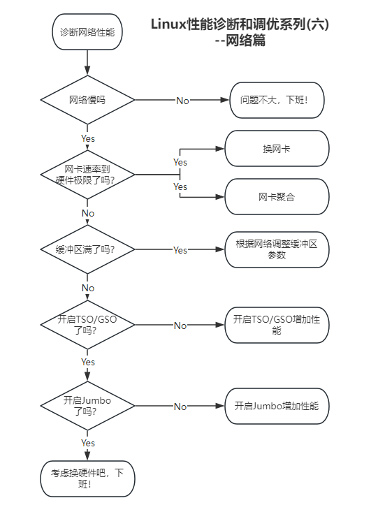
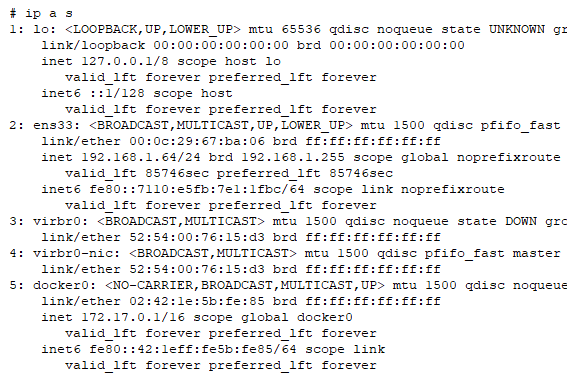
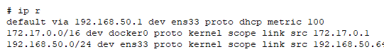
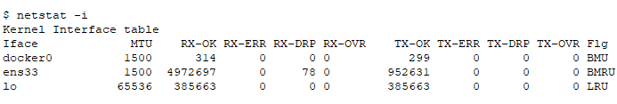
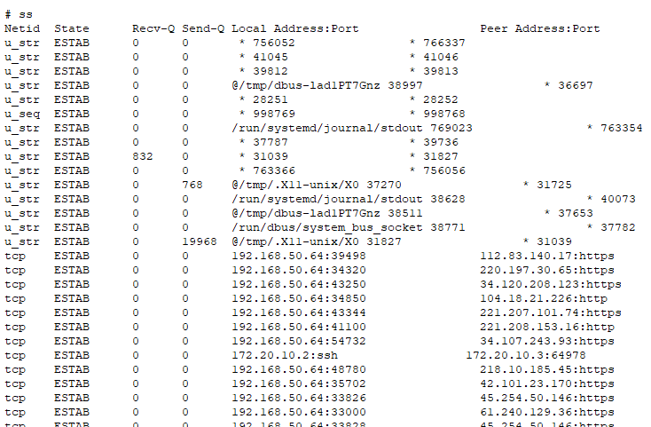
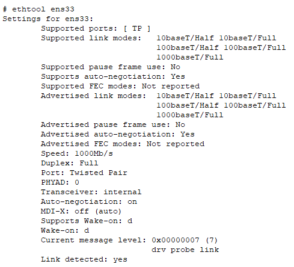
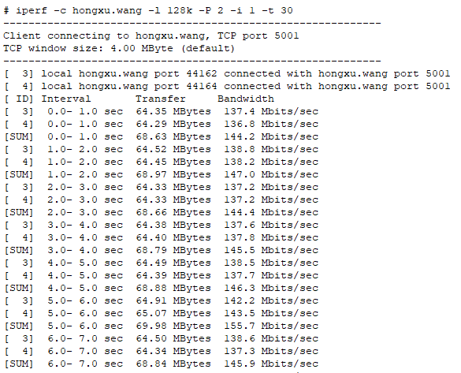
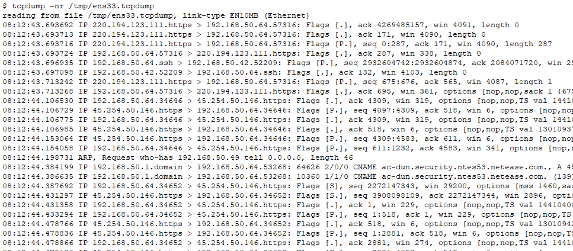

Linux性能诊断和调优系列(六)--网络篇

# 目录
如何查看网络性能？
网络性能瓶颈一般出现在哪里？
网络参数一般有哪些？
缓冲区设置多大？
window scaling？
Jumbo frames(巨型帧)
测试网络性能
网络聚合
TSO和GSO
如何提高网络性能？
总结和建议
# 如何查看网络性能？
ip addr show命令显示网络ip地址及其配置信息
ip route命令显示路由信息
nestat命令的-i参数显示网络接口的各种统计信息
ss命令显示套接字及其相关信息
ethtool命令显示网卡的驱动和硬件配置信息
iperf可用于测试网络性能
tcpdump可用于抓取并检查网络数据包
文章末尾有这些命令的例子和输出。
# 网络性能瓶颈一般出现在哪里？
最常见的网络性能瓶颈出现在网卡的缓冲区，在有超过其处理能力的数据包过来时，就可能会有数据包被丢弃。
其次的性能瓶颈是应用程序的接收缓存区，一般是因为数据包无法被及时给到应用程序的进程处理。
还有可能出现性能瓶颈的地方是中断，例如发起中断的和处理中断的不是同一颗CPU，从而导致延迟或处理器争用；或者因为中断产生livelock。
# 网络参数一般有哪些？
重要而且常用的网络参数一般有：
tcp发送、接收缓冲区大小，过小可能会导致数据包被丢弃，过大可能会导致小数据包性能变慢。
socket的发送、接收缓冲区大小。
操作系统层面TCP、UDP最大的可用内存值。
# 缓冲区设置多大？
默认的缓冲区大小为85KB，但是其实缓冲区大小与网络的质量和速度是正相关的，建议的缓冲区的值比网络的带宽与网络的速度的积大一些。
# window scaling？
Linux默认的窗口最大值是64KB，但是如果两端都支持，这个值是可以自动协商的，从而增大窗口。
如果 net.ipv4.tcp_window-scaling参数设置为1，内核就会尝试协商window scaling。
# Jumbo frames(巨型帧)
随着软硬件支持的网速越来越快，Jumbo frames也成为了一种必须。
默认的MTU是1500b，这对于现代的网速(特别是局域网)已经不够用，因此可以增大MTU，大于1500的MTU叫jumbo frames。
注意：jumbo frame要求网络中的所有设备都支持才可以！
如果网络两端，只有一端开启了jumbo frame，而另一端没有开启，就会变成了单向网络！
# 测试网络性能
测试网络性能可以借助工具，常用的工具有iperf等。
这类工具可以指定多种参数，使用多线程让网络到达极限。

# 网络聚合
可以使用ip、nmcli、teamd、bonding等命令来创建、管理网络聚合。
在Red Hat 8中，Teaming是被推荐使用，而且不影响以前的bonding drive。
但是，teamd已经在Red Hat 9中已被弃用，并计划在Red Hat 10中被移除。
# TSO和GSO
网速越来越快，所以允许网卡硬件来代替CPU执行数据包的分段工作，这样即可以降低CPU负载，还可以提高网络性能。
可以使用 ethtool命令来查看和修改TSO和GSO参数。
但是要注意，如果你对网络延迟很敏感，那么开启这个参数可能适得其反！
# 如何提高网络性能？
如果想提高网络性能，可以从以下几个方面考虑：
1. 使用更快的网卡(好像是废话)。
2. 开启TSO等硬件加速功能(如果对网络延迟不那么敏感)。
3. 开启Jumbo frames(需要整个网络支持)。
4. 根据网络情况调整缓冲区。
5. 根据整体情况设置网络参数：net.ipv4.tcp_rmem, net.ipv4.tcp_wmem, net.core.rmem_max, net.core.wmem_max。
# 总结和建议
1. 使用ip、ifconfig、netstat、ss、ethtool等命令查看网络配置。
2. 使用iperf、tcptop、tcpdump、wireshark等工具分析网络性能。
3. 网络性能瓶颈一般出现在缓冲区，可以根据情况修改相关参数。
4. 将window scaling的net.ipv4.tcp_window-scaling开启。
5. 如果可以，使用Jumbo frames。
6. 网络聚合是最简单增加性能和可用性的办法。
7. TSO和GSO等offload是好东西，建议使用！
8. 提高网络性能无非就是提高网络链路各部分性能。
# 如何查看网络性能？
ip addr show命令显示网络ip地址及其配置信息

ip route命令显示路由信息

nestat命令的-i参数显示网络接口的各种统计信息

ss命令显示套接字及其相关信息

ethtool命令显示网卡的驱动和硬件配置信息

iperf可用于测试网络性能

tcpdump可用于抓取并检查网络数据包

# 更多内容请参见本系列其他文章
<<Linux性能诊断和调优系列(一)--30秒3条命令诊断Linux性能瓶颈>>
<<Linux性能诊断和调优系列(二)--CPU篇>>
<<Linux性能诊断和调优系列(三)--内存篇>>
<<Linux性能诊断和调优系列(四)--硬盘篇>>
<<Linux性能诊断和调优系列(五)--文件系统篇>>
<<Linux性能诊断和调优系列(六)--网络篇>>
<<Linux性能诊断和调优系列(七)--虚拟机及容器篇>>
<<Linux性能诊断和调优系列(八)--虚拟环境性能调优案例>>
<<Linux性能诊断和调优系列(九)--计算密集型应用性能调优案例>>
<<Linux性能诊断和调优系列(十)--存储密集型应用性能调优案例>>
<<Linux性能诊断和调优系列(十一)--大内存型应用性能调优案例>>

本文内容为原创，如需转载，请务必注明原文出处。
更多相关内容，欢迎访问我的个人网站：hongxu.wang。
我们还提供免费的技术支持，欢迎通过公众号与我们联系。