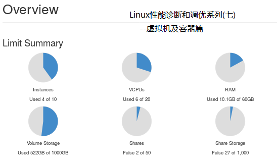

Linux性能诊断和调优系列(七)--虚拟机及容器篇

# 目录
虚拟机的CPU
虚拟机的内存
虚拟机的磁盘
虚拟机的网络
PCI直通
容器
虚拟机和容器的性能监控
# 正文
对于虚拟机及容器，最常见的性能问题一般都是因为其"邻居"导致的：同一宿主机的其他邻居因为高负载或运行性能测试等情况，导致其他"邻居"的资源和性能被损害。所以，要确保虚拟机或容器的性能，就要实现资源隔离！
# 虚拟机的CPU
虚拟机的CPU是作为宿主机的进程运行的，所以可以将虚拟机CPU绑定到宿主机指定的物理CPU上，从而增加性能。
同时，可以将为虚拟机服务的模拟器线程绑定到宿主机指定的物理CPU上，从而增加性能。
# 虚拟机的内存
虚拟机的内存有2个值：max是可用的最大内存值，current是实际使用内存值，按需设置即可。
huge pages：如果虚拟机要使用大页，那么需要在宿主机和虚拟机都设置huge pages才可以！
Kernel Shared Memory：如果虚拟机和宿主机运行相同的操作系统或工作负载，那么有可能很多内存页是相同的，所以可以通过合并相同内存页来减少整体内存使用率。
# 虚拟机的磁盘
虚拟机的磁盘可以是块设备(裸设备)，也可以是文件(镜像文件)。如果是文件，那么会因为访问过程，从而比块设备的速度慢很多。
但是，虽然块设备提供了比文件更好的性能；可是文件提供更多的特性，例如快照、压缩、加密、可扩展、按需增长和多种预分配机制。
## 虚拟机的磁盘要考虑以下二个方面：
一、限制(保证)虚拟机可使用的物理磁盘的IO，可以使用QoS来实现，从而保证其IO操作的带宽和iops。
二、磁盘的数据缓存在宿主机哪里？是否使用宿主机的缓存？是否异步写？是倾向数据即时性?一致性?性能？是否要支持不同类型虚拟机迁移？
# 虚拟机的网络
虚拟机的网络都使用SR-IOV或MR-IOV，在vmware和openstack等实现中都使用了一系列组件。所以在虚拟机的网络，最重要的就是驱动，建议选择vhost_net这类运行在用户态的，因为其性能更好！
# PCI直通
PCI直通允许虚拟机直接访问宿主机的PCI设备而不用通过虚拟化层，所以可以提高效率，接近了原生硬件的性能，但是这也限制了虚拟机的迁移特性，要慎重考虑！
# 容器
对于容器，Linux使用namespace和cgroup来创建容器，所以一般是通过cgroup来隔离CPU、内存、文件系统、磁盘IO和网络IO。
需要注意的是，在容器中，传统的性能工具可能无法正确显示容器的性能：top、uptime、mpstat、vmstat、free、iostat等这些命令都会显示与宿主机相关的性能，从而可能会产生误导。
而perf等命令可能无法在容器内运行，或者虽然运行，但也会包括其他容器的数据。
# 虚拟机和容器的性能监控
prometheus可以监控各种系统和应用程序的运行状况和性能，例如硬件资源使用情况、操作系统指标、应用程序性能、数据库性能、网络设备状态、虚拟机、容器、微服务和云服务等。
结合支持多种数据源的Grafana，通过其自定义，实现实时展示数据、交互式图表、告警系统。
# 更多内容请参见本系列其他文章
<<Linux性能诊断和调优系列(一)--30秒3条命令诊断Linux性能瓶颈>>
<<Linux性能诊断和调优系列(二)--CPU篇>>
<<Linux性能诊断和调优系列(三)--内存篇>>
<<Linux性能诊断和调优系列(四)--硬盘篇>>
<<Linux性能诊断和调优系列(五)--文件系统篇>>
<<Linux性能诊断和调优系列(六)--网络篇>>
<<Linux性能诊断和调优系列(七)--虚拟机及容器篇>>
<<Linux性能诊断和调优系列(八)--虚拟环境性能调优案例>>
<<Linux性能诊断和调优系列(九)--计算密集型应用性能调优案例>>
<<Linux性能诊断和调优系列(十)--存储密集型应用性能调优案例>>
<<Linux性能诊断和调优系列(十一)--大内存型应用性能调优案例>>

本文内容为原创，如需转载，请务必注明原文出处。
更多相关内容，欢迎访问我的个人网站：hongxu.wang。
我们还提供免费的技术支持，欢迎通过公众号与我们联系。