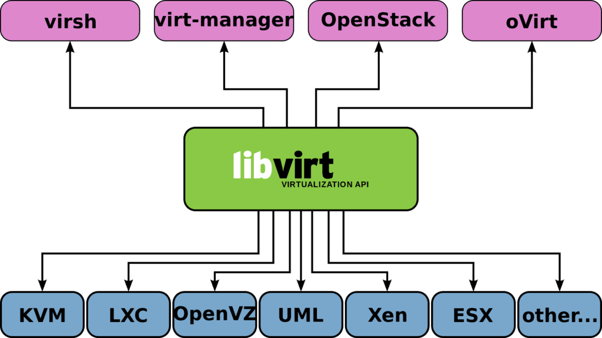

Linux性能诊断和调优系列(八)--虚拟环境性能调优案例

# 目录
libvirt
宿主机建议
虚拟机的CPU建议
虚拟机的内存建议
虚拟机的硬盘建议
# libvirt
libvirt是一个通用的虚拟化管理库，而virsh 是其命令行的虚拟化管理工具 。libvirt 被Openstack、KVM/QEMU、Xen等多家虚拟化采用，而且也可以管理VMware、Hyper-V。以下案例都以virsh为例。
# 宿主机建议
对于虚拟化环境中的宿主机，如果没有特别需求，建议直接使用推荐的virtual-host配置即可。
$ tuned-adm profile virtual-host
# 虚拟机的CPU建议
将虚拟机CPU绑定到宿主机指定的物理CPU上，从而增加性能。
$ virsh vcpupin myvm --config 0 1
将为虚拟机服务的模拟器线程绑定到宿主机指定的物理CPU上，从而增加性能。
$ virsh emulatorpin myvm1 --config 0
# 虚拟机的内存建议
设置虚拟机的内存的hard-limit
$ virsh memtune myvm --config --hard-limit 40G
设置虚拟机的内存的soft-limit
$ virsh memtune myvm --config --soft-limit 32G
## 启用Kernel Shared Memory
$ systmctl enable --now ksm
$ systmctl enable --now ksmtuned
# 虚拟机的硬盘建议
如果侧重性能，可以使用raw格式的硬盘，甚至直接使用直通模式硬盘。
```shell
<disk type='block' device='disk'>
<driver name='qemu' type='raw' cache='none' io='native' />
	<source dev='/dev/vdg' />
	<target dev='vdb' bus='virtio' />
......
</disk>
```
为了保证虚拟机可使用的物理磁盘的IO，通过设置IOPS来保证QoS
$ virsh blkdeviotune myvm vdb --config --total-iops-sec 1000
# 更多内容请参见本系列其他文章
<<Linux性能诊断和调优系列(一)--30秒3条命令诊断Linux性能瓶颈>>
<<Linux性能诊断和调优系列(二)--CPU篇>>
<<Linux性能诊断和调优系列(三)--内存篇>>
<<Linux性能诊断和调优系列(四)--硬盘篇>>
<<Linux性能诊断和调优系列(五)--文件系统篇>>
<<Linux性能诊断和调优系列(六)--网络篇>>
<<Linux性能诊断和调优系列(七)--虚拟机及容器篇>>
<<Linux性能诊断和调优系列(八)--虚拟化环境性能调优案例>>
<<Linux性能诊断和调优系列(九)--计算密集型应用性能调优案例>>
<<Linux性能诊断和调优系列(十)--存储密集型应用性能调优案例>>
<<Linux性能诊断和调优系列(十一)--大内存型应用性能调优案例>>

本文内容为原创，如需转载，请务必注明原文出处。
更多相关内容，欢迎访问我的个人网站：hongxu.wang。
我们还提供免费的技术支持，欢迎通过公众号与我们联系。
