[存储snap分析与可视化展示工具(IBM Storwize系列、FlashSystem系列、SVC系列、联想Storwize系列、浪潮部分AS系列)](http://hongxu.wang:4241/V7000_snap_analyser "存储snap分析与可视化展示工具(IBM Storwize系列、FlashSystem系列、联想Storwize系列、浪潮部分AS系列)")
http://hongxu.wang:4241/V7000_snap_analyser
海外版网址： http://jp.hongxu.wang

支持IBM Storwize系列、FlashSystem系列(微码版本支持V6、V7、V8)、SVC系列、联想Storwize系列、浪潮部分AS系列。
暂时不支持SVC系列。

这是一款存储的snap分析与可视化展示工具，希望能给您带来帮助。

1.自动识别微码版本参数，自动分析和展示结果。
2.性能数据分析后期添加，因为服务器资源不太行。。。

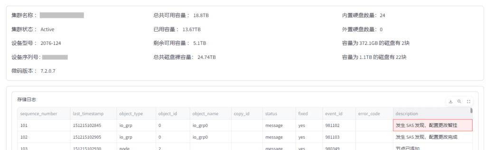
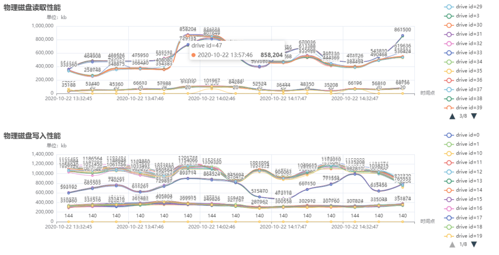
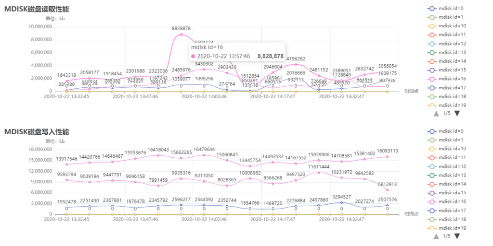
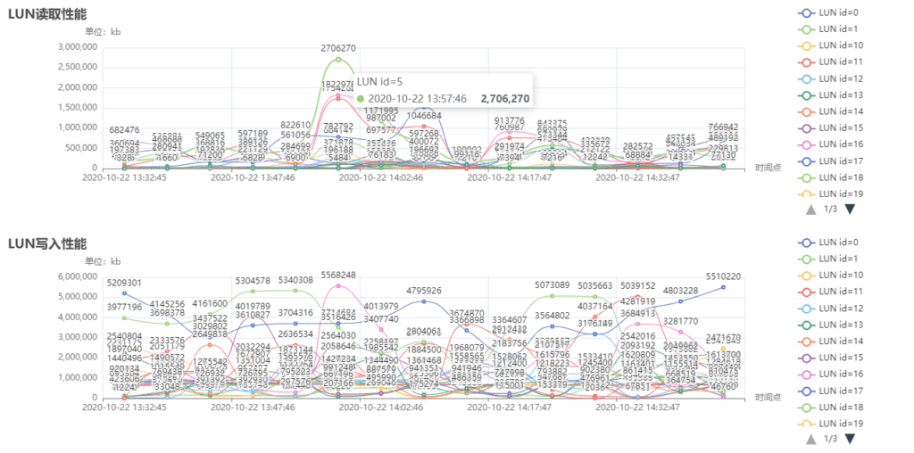
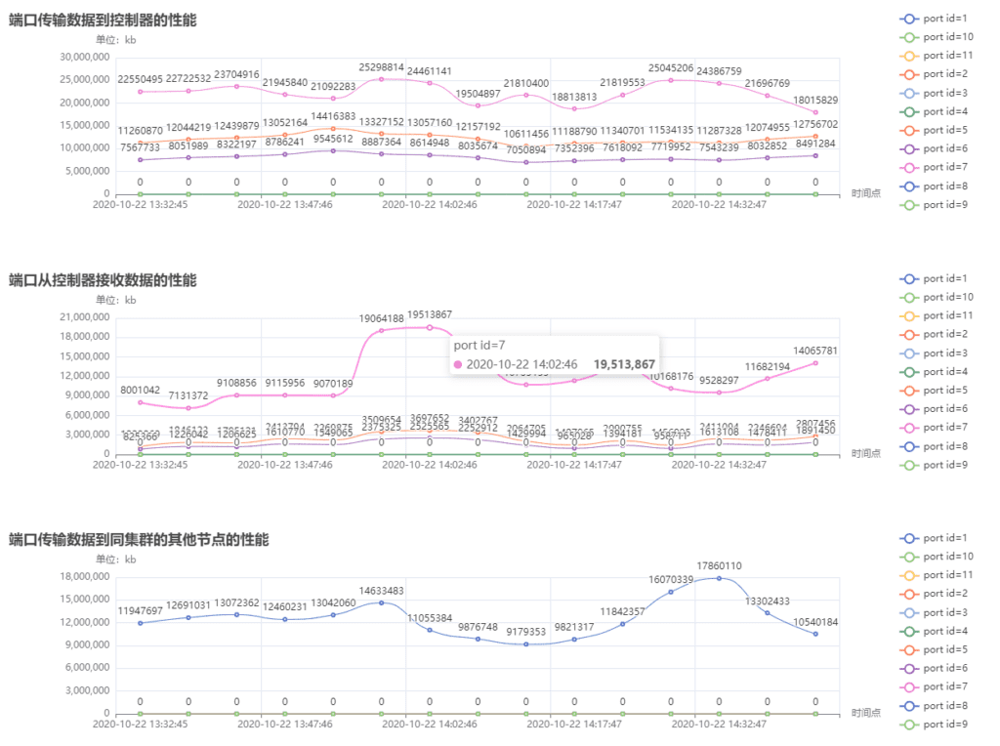
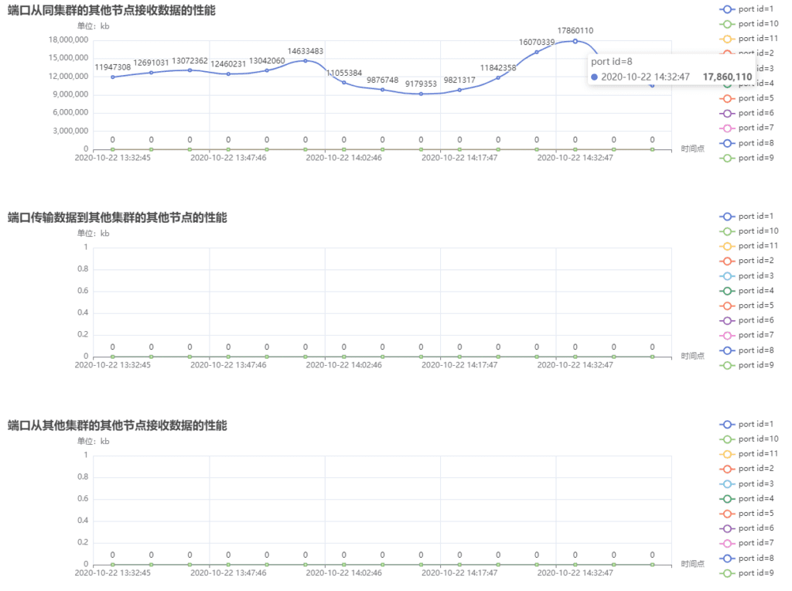

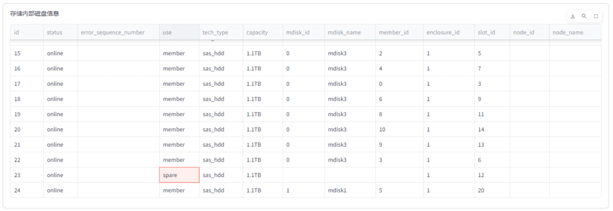
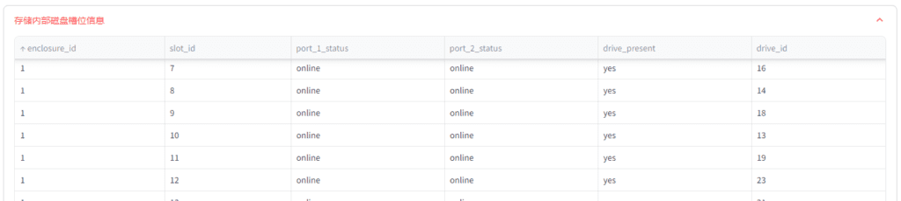
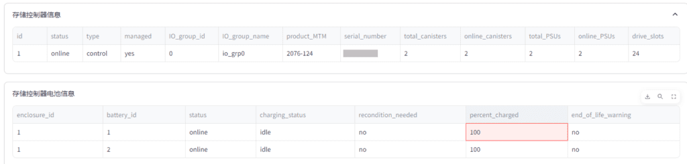
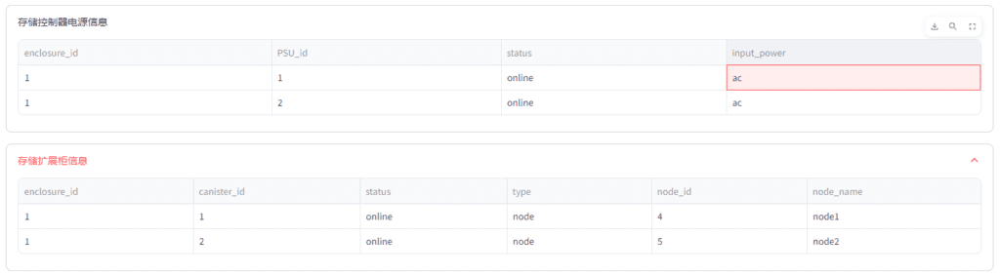
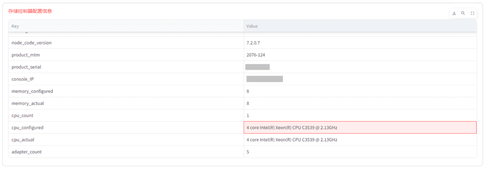
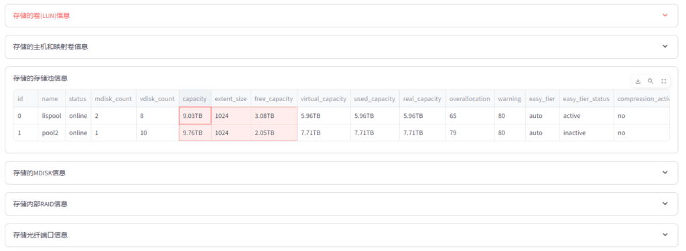
