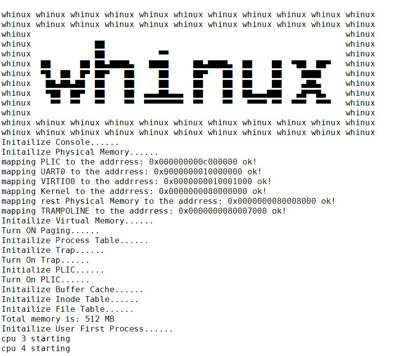
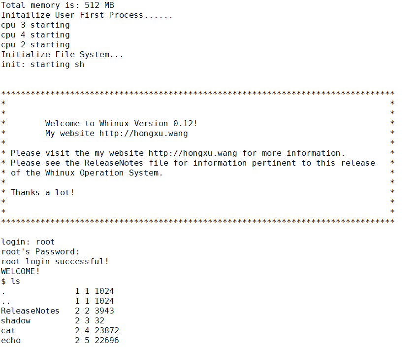
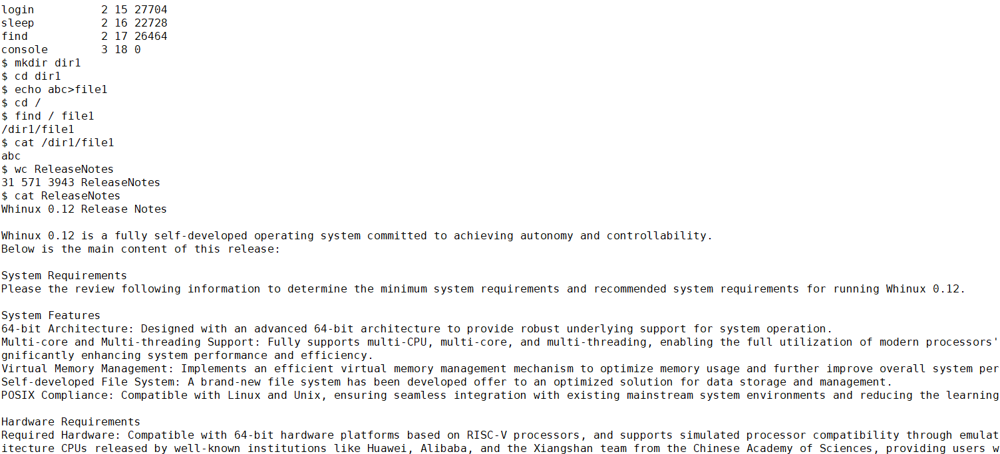

经过多年的积累和沉淀，Whinux 0.12发布，这是一款由我自主研发的小操作系统。
适配华为、阿里巴巴平头哥、中科院香山等国产自研RISC-V架构CPU；
遵循POSIX行业标准，与Linux和Unix兼容；
支持64位、多CPU多进程多线程、进程调度、虚拟内存、分页分段、内存隔离、自研文件系统、快速数据恢复、并发和同步、进程间通信、多用户、用户认证等。

感谢您的关注与支持！期待您的反馈！

# 体验 Whinux OS 的多种方式
我们提供了以下几种方式让您方便地体验和使用 Whinux OS：
- **浏览器**：访问我的个人网站 http://hongxu.wang ，在浏览器中的直接访问 Whinux OS 的命令行界面（需提前预约）。这种方式无需安装任何额外软件，即可随时随地体验 Whinux OS。
- **容器：**下载 Whinux OS 的 Docker 镜像（whinux_0.12），在容器环境中快速启动并运行 Whinux OS。这种方式简单便捷，适合在现有系统上快速部署和测试 Whinux OS
- **虚拟机：**下载 Whinux OS的虚拟机文件，在虚拟机中运行 Whinux OS。这种方式提供了更接近真实硬件环境的测试场景。
- **源代码：**下载 Whinux OS 的源代码，自行编译并运行。这种方式不仅能深入了解 Whinux OS 的内部实现，还能根据需求进行定制开发。

<iframe src="//player.bilibili.com/player.html?isOutside=true&aid=113982526461617&bvid=BV1mjNve2E6n&cid=28325710526&p=1" allowfullscreen="true" style="width:100%; aspect-ratio:16/9;" scrolling="no" border="0" frameborder="no" framespacing="0" allowfullscreen="true"></iframe>

# 系统需求
查看以下信息以确定运行 Whinux 0.12所需的最低系统需求和建议系统需求。

# 系统特性
64位架构。
多CPU多进程多线程：支持多CPU、多核心、多线程、多进程、进程调度。
虚拟内存管理：支持虚拟内存、分页分段、内存隔离。
自研文件系统：自研了文件系统、快速数据恢复。
支持并发和同步、进程间通信、多用户、用户认证等。
遵循 POSIX 标准：兼容 Linux 和 Unix

# 必需硬件
适配包括华为、阿里巴巴平头哥、中科院香山等知名机构发布的国产处理器。
适配 RISC-V处理器的 64 位硬件平台机器，支持QEMU虚拟机方式。

# 内存需求和内存大小容量限制
Whinux 0.12 最低内存需求因配置而异。
Whinux 0.12 的最低内存建议为 128 MB。
Whinux 0.12 随着最大设备数量扩展而增加当前最低内存需求。
对于Whinux 0.12，系统支持最大物理内存容量为 72 PB，最大虚拟内存容量512GB，这是由于Whinux采用了Sv39，可以按需升级为Sv64标准，即支持最大物理内存容量为 16 EB，最大虚拟内存容量16 EB。

# 磁盘需求
Whinux 0.12 建议至少 1GB 的物理磁盘空间用于包含所有默认软件。

# 文件系统和文件大小容量限制
Whinux 0.12，单个文件可采用三级间接索引，单个文件最大16GB；Whinux 0.12的日志型文件系统支持最大容量可按需扩展。